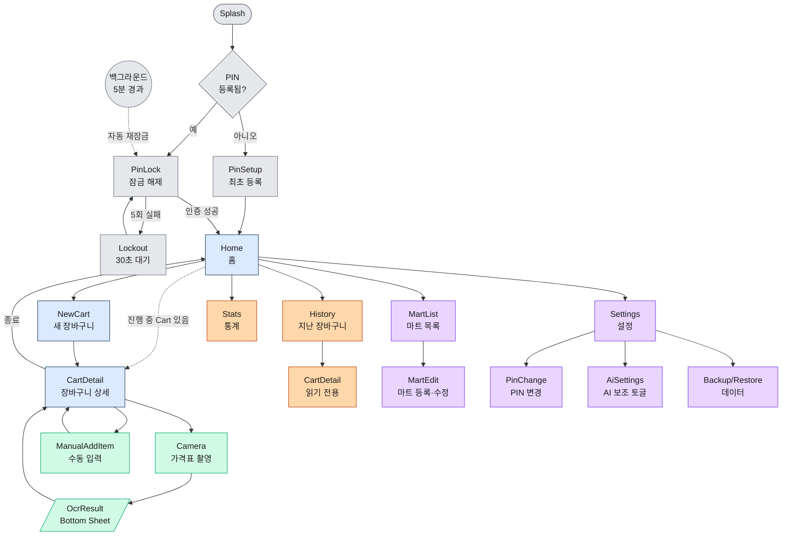
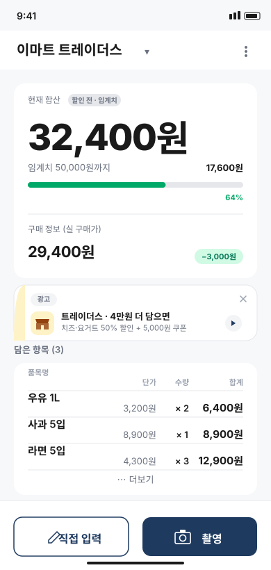
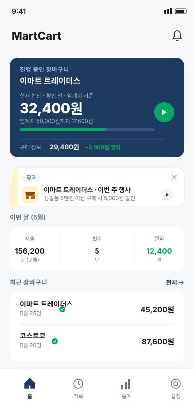
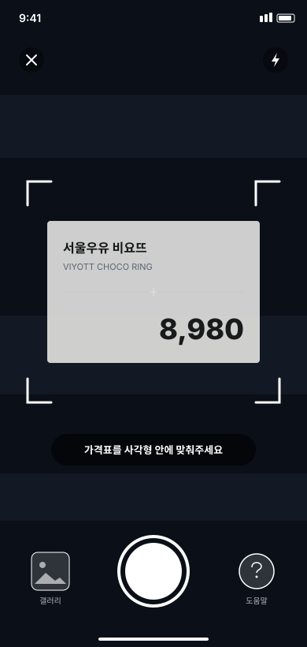
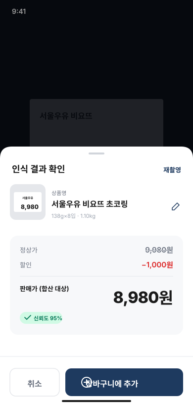
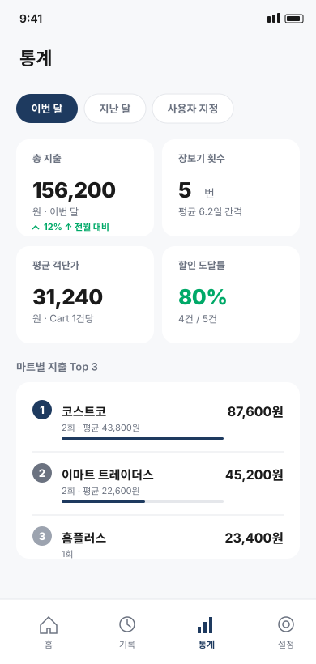

# MartCart · 마트카트 — 대형마트 할인 도달 추적 앱 설계 문서

> **"정상가로 추적하고, 할인가로 결제하세요."**
>
> .NET MAUI 기반의 순수 오프라인 가격 합산·분석 모바일 앱
> 작성일: 2026-05-26 · 문서 버전: v0.1 (MVP 설계)

---

## 1. 프로젝트 개요

### 1.1 한 줄 설명
한국 대형마트의 "**5만원·10만원 이상 구매 시 할인**" 행사를, 가격표를 카메라로 찍기만 해도 **임계치 도달까지 자동으로 추적**해 주는 오프라인 모바일 앱.

### 1.2 배경 / 문제 정의
- 대형마트(이마트, 홈플러스, 코스트코, 트레이더스 등)는 일정 금액 도달 시 할인 쿠폰 / 사은품 / 적립 행사를 자주 운영함.
- 사용자는 장바구니에 담는 동안 **현재 합산 금액과 임계치까지 남은 금액**을 알기 어려움.
- 마트 매장 내부는 통신이 불안정한 경우가 많아 **온라인 의존 앱은 부적합**.

### 1.3 핵심 가치
1. **임계치 자동 추적** — 한국 대형마트 행사의 "정상가 ○○원 이상" 조건 도달 여부를 카메라 한 번으로 실시간 표시. 본 앱의 1순위 차별 가치 (§21 참조)
2. **프라이버시·오프라인** — 네트워크 권한 0개, 모든 데이터는 기기에만. 영수증·구매 기록을 클라우드로 보내지 않음
3. **빠른 입력** — 가격표 촬영 → OCR 자동 분류(정상가/할인/판매가). OCR 실패 시 수동 입력 폴백
4. **개인 데이터 축적** — 장바구니 기록을 로컬에 누적, 추후 소비 분석 기반

### 1.4 주요 설계 결정 (Locked)

본 문서 전체에 적용되는 확정 결정사항. 변경 시 본 절을 먼저 갱신할 것.

| 영역 | 결정 | 참조 |
|------|------|------|
| 프레임워크 | .NET MAUI (.NET 9) — Android 10+ / iOS 15+ | §4 |
| 아키텍처 | MVVM + CommunityToolkit.Mvvm, 4-레이어 (Domain/App/Infra/Presentation) | §5 |
| 카메라 컴포넌트 | **CommunityToolkit.Maui.Camera** | §4 |
| 데이터베이스 | SQLite (sqlite-net-pcl), **비암호화** | §7 |
| 인증 | 4~6자리 PIN, PBKDF2-SHA256 (100k iters) 해시 저장 | §10 |
| 가격 OCR | Android: ML Kit Text Recognition v2 (Latin) / iOS: Vision Framework | §4 |
| 한글 OCR | **Android 전용**, ML Kit Korean (unbundled, 첫 사용 시 다운로드) | §17 |
| 분류 기본 경로 | **Android 지원 기기: Gemini Nano via AICore (기본 ON)** | §16 |
| 분류 폴백 경로 | 휴리스틱 규칙 — 모든 플랫폼/미지원 기기/Nano 실패 시 자동 | §9.3, §17.4 |
| Nano 폴백 트리거 | Fast Failover: 1.5s 타임아웃 + JSON 파싱 + 검증식 통과 강제 | §18.3.A |
| 클라우드 AI | Gemini API (모드 B) — 기본 OFF, 명시적 옵트인. 인사이트(v0.4+)용 | §16.2 |
| 라벨/메타 사전 | **단일 글로벌 사전 시드 + 사용자 수정 학습 누적**. 마트별 분기 없음 | §9.0, §17.4.1, §18.5 |
| 도메인 모델 | `CartItem`에 `OriginalPrice / DiscountAmount / SalePrice` 3분리 | §6.2 |
| 합산 정책 | **임계치 도달 체크는 `OriginalSubtotal`** (UI 라벨: **"현재 합산"** — 할인 전 금액) 기준 / **`SaleSubtotal`은 "구매 정보 (실 구매가)"** 로 보조 표시. 항목 행의 단가·합계는 모두 `SalePrice` 기준 (실 구매가) | §6.2, §8.3 |
| 영문명 / 자동 브랜드 분리 | **별도 필드·자동화 없음**. 사용자 명시 입력만 | §17.5 |
| 분석 범위 (MVP) | 합계/평균/할인 도달률까지. 카테고리·예측은 로드맵 | §11 |
| 네트워크 권한 | 매니페스트에 사전 선언하되 기본 미사용 — 모드 B(Gemini API) 또는 배너 원격 모드(v0.3+) 활성 시에만 실제 사용 | §10.3, §20.6 |
| 광고/프로모션 배너 | 4개 슬롯(Home·CartDetail·History·Stats), v0.1 정적 → v0.2 WebView 컨테이너 → v0.3+ 마트 프로모션 원격 로딩. `IBannerProvider` 추상화 고정 | §20 |

---

## 2. 핵심 사용자 시나리오

### 시나리오 A — 마트 매장 내 사용 (메인 유스케이스)
1. 사용자가 마트 입장 시 앱을 켜고 PIN으로 잠금 해제
2. "새 장바구니" 생성 → 마트 선택(예: 이마트), 할인 임계치 설정(예: 50,000원 → 5,000원 할인)
3. 상품 진열대에서 가격표를 **카메라로 촬영** → OCR로 가격 추출 → 자동 합산
4. OCR이 가격을 못 읽으면 토스트로 알리고 **수동 입력** 화면 띄움
5. 화면 상단에 "현재 합산 32,400원 · 임계치까지 17,600원" 실시간 표시
6. 임계치 도달 시 진동 + 알림 → 사용자가 결제 진행
7. 결제 후 "장바구니 종료" → 기록은 SQLite에 저장

### 시나리오 B — 사후 분석
- 사용자가 홈에서 "지난 장바구니" 목록 확인
- 마트별/기간별 총 지출, 평균 객단가, 할인 도달 비율 등 **요약 카드** 확인

---

## 3. 요구사항

### 3.1 기능 요구사항 (MVP)
| ID | 기능 | 우선순위 |
|----|------|---------|
| F-01 | PIN 4~6자리 잠금 / 잠금 해제 | High |
| F-02 | 마트 마스터 데이터 등록·수정 (이름, 기본 할인 임계치) | High |
| F-03 | 장바구니 세션 생성 / 진행 / 종료 | High |
| F-04 | 카메라 촬영 후 OCR로 가격 추출 (Android 지원 기기: Gemini Nano 기본 경로, 그 외: 휴리스틱 — §16) | High |
| F-05 | OCR 실패/오류 시 수동 가격 입력 | High |
| F-06 | 장바구니 합산 금액 실시간 표시 | High |
| F-07 | 할인 임계치 도달 알림(진동·토스트) | High |
| F-08 | 항목 개별 삭제 / 수량 수정 | High |
| F-09 | 과거 장바구니 목록 조회·상세 보기 | Medium |
| F-10 | 기본 통계(총 지출·평균·이번 달 지출) | Medium |
| F-11 | 데이터 백업/복원 (SQLite 파일 내보내기) | Low |
| F-12 | 카메라 촬영 시 **한글 상품명 자동 추출** (가격과 함께) — **Android 전용** | Medium · 상세 §17 |
| F-13 | **장바구니 삭제** — 진행 중 Cart 폐기 / 종료된 Cart 영구 삭제 | Medium · 상세 §6.2 |
| F-14 | **중복 스캔 감지** — 이미 담긴 상품(이름+가격 일치) 스캔 시 확인 다이얼로그로 "수량 +1 / 별도로 / 취소" 선택 | Medium · 상세 §6.2 |

### 3.2 비기능 요구사항
- **오프라인 전용**: 네트워크 권한 자체를 요청하지 않음 (마케팅 포인트)
- **응답성**: 가격 추가 → 합산 갱신까지 200ms 이내
- **OCR 정확도(가격)**: 표준 가격표 기준 90% 이상 (오인식 시 수동 보정 가능해야 함)
- **OCR 정확도(한글 상품명, Android 전용)**: 표준 가격표 기준 80% 이상 (정확 일치 기준 — 부분 일치 포함 시 90%+). 자세한 정의는 §17.6
- **저장 한계**: 항목 10,000건까지 지연 없이 조회
- **호환성**: Android 10+ / iOS 15+ (MAUI 최소 지원). iOS는 가격 OCR만 제공 (한글 상품명·AI 보조는 Android 전용 — §17, §16 참조)
- **언어**: 한국어 우선 (i18n 구조는 갖춰두되 번역은 추후)

### 3.3 비-요구사항 (Out of Scope)
- 클라우드 동기화, 멀티 디바이스
- 가족/그룹 공유
- 실제 영수증 인식(품목·가격 매칭) — 추후 확장
- 결제·페이 연동

---

## 4. 기술 스택

| 영역 | 선택 | 비고 |
|------|------|------|
| 프레임워크 | .NET MAUI (.NET 9 기준) | 단일 코드베이스로 Android/iOS |
| 언어 | C# | |
| UI 패턴 | MVVM + CommunityToolkit.Mvvm | `[ObservableProperty]`, `[RelayCommand]` |
| DB | SQLite (sqlite-net-pcl) | 비암호화. PIN은 앱 진입 게이트로만 |
| OCR (가격·숫자) | Android: ML Kit Text Recognition v2 (Latin)<br>iOS: Vision Framework (VNRecognizeTextRequest) | 플랫폼별 네이티브 OCR을 추상화 인터페이스로 래핑 |
| OCR (한글 상품명) — **Android 전용** | `com.google.mlkit:text-recognition-korean` (별도 의존성, +5~8MB, Play Services unbundled로 첫 사용 시 다운로드) | F-12 활성 시 필요. iOS에는 미적용. 자세한 필요조건은 §17 |
| AI 보조 (Android, 선택) | Gemini Nano via ML Kit GenAI APIs (온디바이스)<br>Gemini API (클라우드, 옵트인) | 가격표 분류·OCR 보정·소비 인사이트 생성. 미지원 기기는 휴리스틱 폴백. 자세한 내용은 §16 |
| 카메라 | `CommunityToolkit.Maui.Camera` | .NET MAUI Community Toolkit 공식 컴포넌트 |
| DI | `Microsoft.Extensions.DependencyInjection` (MAUI 내장) | |
| 로깅 | `Microsoft.Extensions.Logging` + 파일 싱크 | 진단용 로컬 로그 |
| 테스트 | xUnit (도메인 단위) / 수동 QA (UI) | |

---

## 5. 아키텍처

### 5.1 레이어 구성
```
┌─────────────────────────────────────────┐
│  Presentation  (Views / ViewModels)     │  ← XAML, MVVM
├─────────────────────────────────────────┤
│  Application   (Services / UseCases)    │  ← CartService, OcrService...
├─────────────────────────────────────────┤
│  Domain        (Models / Contracts)     │  ← Cart, Item, IPriceOcr...
├─────────────────────────────────────────┤
│  Infrastructure (SQLite / OCR / Files)  │  ← SqliteRepo, MlKitOcr...
└─────────────────────────────────────────┘
```

- **Domain은 외부 의존 0** — 순수 C# 클래스만. 단위 테스트 용이.
- Presentation은 Domain과 Application Service 인터페이스만 의존, 구현체는 DI로 주입.
- OCR/카메라 등 플랫폼 API는 `Platforms/Android`, `Platforms/iOS`에서 partial class로 구현하여 공통 인터페이스(`IPriceOcr`)에 바인딩.

### 5.2 주요 인터페이스 (Domain 계층)
```csharp
public interface IPriceOcr
{
    Task<OcrResult> ExtractPriceAsync(Stream image, CancellationToken ct);
}

public interface ICartRepository
{
    Task<Cart> CreateAsync(Guid martId, decimal threshold);
    Task<Cart?> GetAsync(Guid cartId);
    Task AddItemAsync(Guid cartId, CartItem item);
    Task<IReadOnlyList<Cart>> ListAsync(DateRange range);
}

public interface IMartRepository { /* ... */ }
public interface IAuthGate { Task<bool> UnlockAsync(string pin); }
```

### 5.3 의존성 흐름 (예: 가격 추가)
```
View (CameraPage)
  └─ ViewModel (CartViewModel.AddByCameraAsync)
        ├─ IPriceOcr.ExtractPriceAsync()      ← MlKitOcr / VisionOcr
        ├─ ICartRepository.AddItemAsync()     ← SqliteCartRepository
        └─ Notifies UI: Total, Remaining
```

---

## 6. 도메인 모델

### 6.1 클래스 다이어그램 (텍스트)
```
Mart                Cart                  CartItem
─────               ────                  ────────
Id (Guid)           Id (Guid)             Id (Guid)
Name                MartId  ──────────►   CartId
DefaultThreshold    StartedAt             Name
DefaultDiscount     ClosedAt?             OriginalPrice   ─ 원금액 (정상가)
                    Threshold (snap)      DiscountAmount  ─ 할인금액
                    Items: List<>         SalePrice       ─ 판매금액 ★합산 대상
                    Subtotal (computed)   Quantity
                                          Source (OCR/Manual/AI)
                                          OcrConfidence (0~1)
                                          PhotoPath
                                          CreatedAt
```

### 6.2 핵심 비즈니스 규칙

**두 합산의 역할 분리** (중요)

대형마트 할인 행사의 임계치(`○○원 이상 구매`)는 일반적으로 **할인 적용 전 정상가 기준**으로 판정된다. 사용자는 동시에 **할인 적용된 실제 결제 예상액**도 알고 싶어한다. 본 앱은 두 합산을 명확히 분리해 표시한다.

| 필드 | UI 라벨 | 정의 | 역할 |
|------|--------|------|------|
| `Cart.OriginalSubtotal` | **"현재 합산"** (할인 전) | `Σ (Item.OriginalPrice × Quantity)` | **임계치 도달 체크의 유일한 기준**. 화면에서 진행률 바·잔여 금액의 기준값 |
| `Cart.SaleSubtotal` | **"구매 정보"** (실 구매가) | `Σ (Item.SalePrice × Quantity)` | 실제 결제 시 예상 금액. 화면에서 보조로 표시 |
| `Cart.TotalSaved` | "절약" / "−N원" | `Σ (Item.DiscountAmount × Quantity)` = `OriginalSubtotal − SaleSubtotal` | 누적 절약액 (분석·표시) |

**항목 행 표시**: 단가 = `SalePrice`, 합계 = `SalePrice × Quantity` (모두 **실 구매가**). 항목 행에서는 `OriginalPrice`를 표시하지 않으며, 두 합산의 차이는 hero 카드에서 한 번만 노출.

**임계치 판정 규칙**

- `Cart.Remaining = max(0, Threshold − OriginalSubtotal)` — **정상가 기준**
- `Cart.IsThresholdReached = OriginalSubtotal >= Threshold` — **정상가 기준**
- `SaleSubtotal`은 임계치 판정에 사용되지 않는다.

**기타 규칙**

- 할인 없는 단일 금액 가격표인 경우: `OriginalPrice = SalePrice`, `DiscountAmount = 0` → 두 합산이 동일.
- 분류 검증식: 3개 가격이 동시에 인식되었을 때 `|OriginalPrice − DiscountAmount − SalePrice| ≤ 10원`이면 매핑 확정. 어긋나면 사용자 확인 필요로 표시.
- `Cart.Threshold`는 생성 시점에 **마트의 기본값을 스냅샷**으로 복사 (마스터 변경에 영향받지 않도록).
- 종료된(`ClosedAt != null`) Cart는 항목 추가/수정 불가 — 도메인 레벨에서 가드.

**항목 편집/삭제 규칙 (F-08)**

진입점 3가지 (전용 `⋯` 아이콘은 두지 않음):

| 진입점 | 동작 |
|--------|------|
| 행 전체 탭 | 항목 편집 Bottom Sheet 호출 — 수량 stepper `−/+`, 메모 추가, 삭제 버튼 |
| 좌→우 스와이프 | 거리 ≥ 행 너비 40% + 햅틱(`light`) → release 시 즉시 삭제 + 4초 Undo 스낵바 |
| 중복 스캔 다이얼로그 (F-14) | "수량 +1" 액션으로 기존 항목의 `Quantity++` |

- 항목 수량 수정·삭제는 **진행 중 Cart (`ClosedAt == null`)에서만** 허용 — 종료된 Cart는 탭/스와이프 모두 무반응 (도메인 가드).
- 삭제는 **확인 다이얼로그 없이 즉시 실행** + **4초 Undo 스낵바** 제공 (스낵바 닫힘 시 hard delete 확정).
- 수량 stepper에서 `0`이 되면 자동으로 삭제 흐름 진입.
- 편집 Bottom Sheet 내 변경은 stepper 조작 즉시 자동 저장 — 별도 "저장" 버튼 없음.
- 합산(`OriginalSubtotal`·`SaleSubtotal`·`TotalSaved`)과 진행률 바는 항목 변경 즉시 갱신.
- Cart 삭제(F-13)와 정책이 다른 이유: 항목 삭제는 빈도가 높고 영향 범위가 작아 Undo가 효율적. Cart 삭제는 영향이 크므로 확인 다이얼로그가 더 적합.

**중복 스캔 감지 규칙 (F-14)**

OCR 분류 직후 OcrResult Bottom Sheet 표시 **직전**에 진행 중 Cart 내 기존 항목과 대조하여 중복 여부를 판정한다.

- **동일 상품 판정 기준** (모두 만족):
  - `Name` 정규화 일치 (공백 압축 + 대소문자 무시)
  - `OriginalPrice` 일치 AND `SalePrice` 일치 (±10원 허용)
- **검사 범위**: 현재 진행 중 Cart의 항목만 (종료된 Cart·다른 Cart는 비교 대상 아님)
- **감지 시점**: §9.1 단계 6과 7 사이 — Bottom Sheet 띄우기 전에 모달 다이얼로그로 가로채기
- **다이얼로그 액션 3가지**:

| 액션 | 결과 |
|------|------|
| **수량 +1** | 기존 항목의 `Quantity++`, OcrResult Bottom Sheet는 표시하지 않고 카메라로 복귀. 합산 즉시 갱신 |
| **별도로 담기** | 일반 흐름대로 OcrResult Bottom Sheet 표시, 사용자 확정 시 별도 행으로 추가 |
| **취소** | 아무 항목도 추가되지 않음, 카메라로 복귀 |

- **이미지 perceptual hash로 강화** (선택): 같은 가격표를 짧은 간격으로 재스캔한 경우 다이얼로그의 기본 선택을 "취소"로 (실수 방지). MVP에서는 도입 안 함, 텔레메트리로 필요성 확인 후 v0.2+.

**Cart 삭제 규칙 (F-13)**

| 대상 | 동작 라벨 | 확인 다이얼로그 | 통계 영향 |
|------|---------|---------------|---------|
| 진행 중 Cart (`ClosedAt == null`) | **폐기** | 1단계 ("이 장바구니를 폐기할까요?") | 없음 (애초에 집계 대상 아님) |
| 종료된 Cart (`ClosedAt != null`) | **삭제** | 1단계 + **"통계에서 X원이 제외됩니다"** 명시 | 해당 Cart의 `SaleSubtotal`·`TotalSaved`가 즉시 통계에서 제외 |

- 두 동작 모두 **hard delete** — SQLite `DELETE FROM Cart WHERE Id = ?` → `ON DELETE CASCADE`로 `CartItem` 자동 동반 삭제.
- **Undo는 도입하지 않음** — 오프라인 앱 단순성 우선. 확인 다이얼로그 1단계가 안전장치 역할.
- 진입점: CartDetail 우상단 ⋮ 메뉴 + History 리스트 좌→우 스와이프 (또는 long-press).

---

## 7. 데이터 모델 (SQLite)

### 7.1 테이블 스키마
```sql
CREATE TABLE Mart (
    Id              TEXT PRIMARY KEY,         -- GUID
    Name            TEXT NOT NULL,
    DefaultThreshold     REAL NOT NULL DEFAULT 0,
    DefaultDiscountAmount REAL NOT NULL DEFAULT 0,
    CreatedAt       TEXT NOT NULL
);

CREATE TABLE Cart (
    Id              TEXT PRIMARY KEY,
    MartId          TEXT NOT NULL REFERENCES Mart(Id),
    Threshold       REAL NOT NULL,            -- 생성 시 스냅샷
    DiscountAmount  REAL NOT NULL,
    StartedAt       TEXT NOT NULL,
    ClosedAt        TEXT NULL,
    Memo            TEXT
);
CREATE INDEX IX_Cart_StartedAt ON Cart(StartedAt);

CREATE TABLE CartItem (
    Id              TEXT PRIMARY KEY,
    CartId          TEXT NOT NULL REFERENCES Cart(Id) ON DELETE CASCADE,
    Name            TEXT,                     -- 상품명 (OCR 추출 또는 수동 입력)
    Brand           TEXT NULL,                 -- 브랜드/제조사 (별도 추출 가능 시)
    NameSource      INTEGER NOT NULL DEFAULT 1,-- 0=OCR, 1=Manual, 2=AI-assisted, 3=ProductDB(향후)
    OriginalPrice   REAL NOT NULL,            -- 원금액 (정상가). 할인 없으면 = SalePrice
    DiscountAmount  REAL NOT NULL DEFAULT 0,  -- 할인금액
    SalePrice       REAL NOT NULL,            -- 판매금액 ★ Cart.Subtotal 합산 기준
    Quantity        INTEGER NOT NULL DEFAULT 1,
    Source          INTEGER NOT NULL,         -- 0=OCR, 1=Manual, 2=AI-assisted
    OcrConfidence   REAL NULL,                -- 0~1, 분류 검증식 통과 여부 등
    PhotoPath       TEXT NULL,
    CreatedAt       TEXT NOT NULL
);
CREATE INDEX IX_CartItem_CartId ON CartItem(CartId);

CREATE TABLE AppSettings (
    Key             TEXT PRIMARY KEY,
    Value           TEXT
);  -- PinHash, Salt, LastBackupAt 등
```

### 7.2 PIN 저장
- DB 자체는 비암호화이지만 **PIN은 평문 저장 금지**.
- `AppSettings.PinHash` = `PBKDF2(pin, salt, 100_000 iters, SHA-256)` 결과 hex.
- Salt도 `AppSettings.PinSalt`에 함께 저장.

### 7.3 마이그레이션
- sqlite-net-pcl의 `CreateTableAsync<T>()`로 초기 생성.
- 스키마 변경 시 `AppSettings.SchemaVersion` 기준으로 절차적 마이그레이션 코드 작성.

---

## 8. 화면 / UI 흐름

### 8.1 화면 구성 (요약)

```
[Splash]
   │
[PinLock]  ──(첫 실행 시)──►  [PinSetup]
   │
[Home]
   ├─► [MartList]  ─►  [MartEdit]
   ├─► [NewCart]   ─►  [CartDetail]
   │                       ├─► [Camera]  ─►  [OcrResult]
   │                       └─► [ManualAddItem]
   ├─► [History]   ─►  [CartDetail (Read-only)]
   ├─► [Stats]
   └─► [Settings] ─┬─► [PinChange]
                    ├─► [AiSettings]
                    └─► [Backup/Restore]
```

### 8.2 페이지 맵 (Navigation Graph)

> Mermaid 다이어그램 — VSCode의 마크다운 미리보기에서 렌더링됨. 화면 색상은 역할별 그룹:
> **회색** 인증 게이트 · **파랑** 메인 흐름 · **녹색** 데이터 입력 · **주황** 조회 · **보라** 설정.



**범례 / 노트**
- 실선 화살표: 사용자 명시적 네비게이션
- 점선 화살표: 시스템 트리거(자동 잠금, 진행 중 Cart 자동 진입)
- `[/...../]` 형태: Bottom Sheet (다른 화면 위에 부분 오버레이, §19.5)
- 모든 화면은 시스템 백 키 / 좌상단 ← 로 이전 화면으로 복귀 (Settings 하위 화면들 포함)
- 백그라운드 진입 후 5분 경과 시 어떤 화면에서든 PinLock으로 강제 전환 (§10.1)

### 8.3 CartDetail (메인 화면) 와이어프레임

§19 디자인 시스템(컬러·타이포·간격)이 적용된 SVG 와이어프레임. iPhone 14 (390pt) 기준.



**구성 요소 매핑** (§19 토큰 · §6.2 합산 정책)

| 영역 | 사양 |
|------|------|
| 앱바 | `Surface` 배경, 56dp · 마트 셀렉터(드롭다운) + overflow 메뉴 (⋮) |
| 앱바 ⋮ 메뉴 항목 | **종료** (F-03) · **메모 수정** · **장바구니 폐기/삭제** (F-13 — 진행 중이면 "폐기", 종료됨이면 "삭제") · 임계치 변경 |
| Hero 카드 | `Surface` 16dp radius · 280dp 높이 — **현재 합산**(할인 전·임계치 기준) + **구매 정보**(실 구매가) 두 블록으로 분리 |
| 현재 합산 | **Display 52sp / weight 800**, `tabular-nums` · "할인 전 · 임계치" 회색 알약 배지 · 진행률 바 8dp · `Accent` 채움. 필드 `OriginalSubtotal` |
| 구매 정보 (실 구매가) | Headline 22sp · 우측에 절약액 `Accent` 알약 배지 (`−3,000원`) — 임계치 판정에 영향 없음을 시각적으로 분리. 필드 `SaleSubtotal` |
| 배너 슬롯 `cart_inline` | hero 카드와 항목 리스트 **사이** 350×80dp. 좌측 액센트 띠 + `[광고]` 라벨 + 마트 아이콘 + 닫기(✕) + CTA. 진행 중 Cart에서만 표시. 상세 §20 |
| 항목 카드 | `Surface` 16dp radius · 카드 높이 190dp · 헤더 2줄 + 각 항목 2줄(약 38dp/행) + 1dp `Divider`로 행 구분 |
| 항목 행 컬럼 (**2줄 구조**) | **1줄**: 품목명 (15sp 600, 좌측 정렬) — 긴 한글 상품명 수용 (예: "서울우유 비요뜨 초코링")<br>**2줄**: 단가 (13sp `OnSurfaceMuted`, 우측 정렬 x=225, = `SalePrice`) · 수량 (13sp 600, 중앙 정렬 x=262, "× N") · 합계 (15sp 700, 우측 정렬 x=350, = `SalePrice × Quantity`)<br>헤더 행도 동일 2줄 구조로 컬럼 라벨이 정렬됨 |
| 합산 관계 | Σ(합계 컬럼) = hero의 **구매 정보** (`SaleSubtotal`) 와 일치. hero의 **정상가 합산** (`OriginalSubtotal`) 은 `OriginalPrice × Quantity`의 합으로 별도 계산 — 행에는 표시하지 않음. 단가/합계 컬럼에는 **사용자가 가격표에서 본 실제 판매가**가 표시되어 영수증 멘탈 모델과 일치 |
| 항목 행 편집 (F-08) | **행 전체가 탭 영역** — 탭 시 항목 편집 Bottom Sheet 호출 (수량 stepper `−/+`, 메모 추가, 삭제). **좌→우 스와이프**(거리 ≥ 행 너비 40%)로 빠른 삭제 + 4초 Undo 스낵바. 전용 `⋯` 아이콘은 두지 않음 (4컬럼 정렬·`tabular-nums` 보호 + 한국 모바일 표준 패턴). 진행 중 Cart에서만 활성 |
| Primary 버튼 (촬영) | `Primary`(#1E3A5F) 배경, 56dp 높이, 12dp radius, 흰색 카메라 아이콘 |
| Secondary 버튼 (직접 입력) | outlined 1.5dp `Primary`, 동일 규격 |

**텍스트 대안** (스크린리더·터미널 환경용)

```
┌──────────────────────────────────┐
│  이마트 트레이더스 ▾          ⋮  │
├──────────────────────────────────┤
│  현재 합산  [할인 전 · 임계치]   │
│  32,400원                        │
│  임계치 50,000원까지   17,600원  │
│  [████████░░░░░░░] 64%           │
│  ─────────────────────────       │
│  구매 정보 (실 구매가)           │
│  29,400원        [−3,000원]      │
├──────────────────────────────────┤
│ [광고]                        ✕ │
│ [▣] 트레이더스 · 4만원 더 담으면│
│     치즈·요거트 50% 할인+쿠폰 → │
├──────────────────────────────────┤
│  담은 항목 (3)                   │
│  품목명                          │
│            단가   수량    합계   │
│  ─────────────────────────      │
│  우유 1L                         │
│           3,200원  ×2   6,400원  │
│  ─────────────────────────      │
│  사과 5입                        │
│           8,900원  ×1   8,900원  │
│  ─────────────────────────      │
│  라면 5입                        │
│           4,300원  ×3  12,900원  │
│  ⋯ 더보기                        │
├──────────────────────────────────┤
│  [ 직접 입력 ]   [ 📷 촬영 ]    │
└──────────────────────────────────┘
```

### 8.4 Home 와이어프레임

홈 화면. 진행 중 Cart가 있으면 강조(딥 네이비 카드)하여 "이어하기" 동선을 우선 노출. 이번 달 미니 통계 + 최근 장바구니 3건 요약. 하단 4-탭 네비게이션.



| 영역 | 사양 |
|------|------|
| 진행 중 Cart 카드 | `Primary` 배경, 흰색 텍스트, 우측 `Accent` FAB로 이어하기 액션 — **현재 합산 (할인 전 · 임계치 기준)** 강조 + 하단에 **구매 정보 (실 구매가)** 보조 표시 |
| 배너 슬롯 `home_main` | `Surface` 16dp radius + 1dp `Divider` 테두리, 350×80dp. 좌상단 `[광고]` 라벨 칩, 우상단 닫기(✕). v0.1 정적 콘텐츠 → v0.3+ 원격 마트 프로모션. 상세 §20 |
| 퀵 액션 위치 | **제거됨** — "새 장바구니"는 빈 상태 hero CTA로, 활성 시에는 hero ⋮ 메뉴로 이동. "마트 관리"는 Settings 탭으로 이동 |
| 이번 달 통계 카드 | 3분할 (지출·횟수·평균), 수직 `Divider` |
| 최근 장바구니 리스트 | 마트명 + 날짜 + 합계 + 할인 도달 시 `Accent` 체크 배지 |
| 하단 탭바 | 80dp, 4개 탭 (홈·기록·통계·설정), 활성 탭은 `Primary` |

### 8.5 Camera 촬영 화면 와이어프레임

풀스크린 카메라 프리뷰 위에 가이드 프레임 오버레이. 셔터는 §19.5 규격대로 88dp 원형, 한 손 사용을 고려해 화면 하단 중앙에 배치.



| 영역 | 사양 |
|------|------|
| 배경 | 카메라 라이브 프리뷰 (`#0A0F18` 폴백) |
| 상단 액션 | 좌측 닫기(X), 우측 플래시 토글 — 반투명 검정 원형 배경 |
| 가이드 프레임 | 흰색 코너 마커만 (전체 박스 X) — 가격표 정렬 보조 |
| 가이드 텍스트 | 반투명 알약 형태, 하단에 배치 |
| 하단 액션 | 좌측 갤러리, 중앙 셔터 88dp, 우측 도움말 |

### 8.6 OcrResult Bottom Sheet 와이어프레임

촬영 직후 표시되는 Bottom Sheet (§19.5). 가격은 §17.7 / §6.2의 3분리 구조(정상가·할인·판매가)를 그대로 표시하고, 판매가만 강조해 합산 대상임을 시각적으로 명확히 함.



| 영역 | 사양 |
|------|------|
| 백그라운드 | 카메라 프리뷰 위에 40% 검정 오버레이 |
| Bottom Sheet | 상단 24dp radius, 32×4dp 드래그 핸들 |
| 썸네일 + 상품명 | 좌측 72×72dp 캡처 썸네일, 우측 상품명 (편집 가능 아이콘) |
| 가격 카드 | `Background` 색 내부 카드 — 정상가(취소선) / 할인(`Danger` 색) / 판매가(Display 32sp 강조) |
| 신뢰도 뱃지 | 녹색 알약 — 0.95 이상일 때만 표시 |
| 하단 액션 | 좁은 취소 + 넓은 Primary "장바구니에 추가" |
| **중복 감지 변형 (F-14)** | 본 시트를 표시하기 전, 진행 중 Cart에 동일 상품이 있으면 **중간 다이얼로그**를 가로채 띄움 — "이미 담은 상품입니다 · 서울우유 비요뜨 · 8,980원 × 1개" + [수량 +1] [별도로] [취소]. "별도로" 시에만 본 OcrResult 시트로 진행 |

### 8.7 Stats 와이어프레임

§11.1 정의된 4개 핵심 지표(총 지출·횟수·평균·할인 도달률)를 2×2 카드 그리드로, 그 아래 마트별 Top 3를 막대 그래프로 표현. 기간 셀렉터로 이번 달/지난 달/사용자 지정 전환.



| 영역 | 사양 |
|------|------|
| 기간 칩 | 36dp 높이, 18dp radius, 활성은 `Primary` 채움 |
| 메트릭 카드 (2×2) | 170×120dp, 16dp radius, Headline 26sp 수치 |
| 할인 도달률 카드 | 수치 색상을 `Accent`로 강조 (정성적 의미가 강한 KPI) |
| 마트별 Top 3 | 랭킹 배지(1=`Primary`, 2/3=neutral) + 가로 막대 그래프(상대 비율) |
| 하단 탭바 | 통계 탭 활성 (`Primary` 강조) |

---

## 9. 가격 OCR 파이프라인

> 대형마트 가격표는 **정상가 / 할인금액 / 판매금액** 3행 구조이거나, 할인이 없으면 **단일 금액** 구조다. 파이프라인의 목표는 인식된 금액 토큰들을 이 세 역할(또는 단일 판매가)로 **정확히 분류**하는 것이다.

### 9.0 포맷 다양성 대응 원칙

가격표는 마트·시기·상품군에 따라 레이아웃·라벨·표기가 다양하다. 본 파이프라인은 **특정 마트의 가격표 포맷을 가정하지 않는다.**

- **결정 규칙은 포맷 무관 신호 우선**:
  - **수학적 검증식** (`정상가 − 할인 = 판매가`) — 마트·언어·레이아웃 무관하게 동일하게 작동하는 최강 신호
  - **시각 구조** (가장 큰 텍스트, 상대 위치, 폰트 크기 순위) — 레이아웃이 달라도 일반적으로 유효
- **라벨 텍스트·색상·배지는 보조 신호로만** 사용. 결정 규칙으로 쓰지 않음 — 마트마다 어휘가 다르기 때문.
- **마트별 템플릿/사전 분기는 도입하지 않음**. 라벨·메타 키워드 사전은 **단일 글로벌 사전**으로 유지하고, 시드만 제공한 뒤 사용자 수정으로 §18.5 학습 루프를 통해 누적·확장.
- **휴리스틱이 약한 미지의 포맷은 §16 AI 보조(Android, Gemini Nano)가 처리**. 일반화 능력은 휴리스틱보다 AI 모델이 우수하므로 신뢰도 < 0.5에서 트리거.
- 영문명·바코드·단위가격·행사기간 등 **선택적 필드는 존재 여부를 가정하지 않음** — 있으면 무시하거나 제외 가드로 거를 뿐, 별도 컬럼을 만들지 않음.

### 9.1 단계
1. **촬영** — 카메라 컴포넌트로 가격표 사진 캡처 (전체 또는 ROI 크롭)
2. **전처리** — 회전 보정, 흑백 변환, 대비 향상 (Skia 사용 가능)
3. **텍스트 추출** — `IPriceOcr`(숫자) + `IProductNameOcr`(한글, F-12 활성 시) 구현체가 플랫폼 OCR 호출 → 라인 + bounding box 리스트
4. **가격 후보 추출** — 정규식 + §9.2 제외 가드로 가격 토큰 수집
5. **분류 — 기본 경로**: `IPriceClassifier` 호출
   - **Android 지원 기기 + 사용자 ON** → `GeminiNanoPriceClassifier`가 `{원금액, 할인액, 판매가, 상품명, 브랜드}`를 단일 호출로 반환
   - **그 외 (iOS, 미지원 Android, 사용자 OFF)** → `HeuristicPriceClassifier`가 §9.3 + §17.4 규칙으로 분류
6. **폴백** — Nano가 타임아웃/파싱 실패/검증식 실패 시 자동으로 휴리스틱에 위임 (사용자에게 노출되지 않음, `Source="Heuristic"`로만 기록)
7. **중복 스캔 감지** (F-14) — 진행 중 Cart에서 동일 상품(이름 + 가격 일치) 검색. 발견 시 OcrResult 대신 **중복 다이얼로그**로 "수량 +1 / 별도로 / 취소" 분기 (§6.2)
8. **확인 다이얼로그** — 중복이 아니거나 "별도로" 선택 시: 분류 결과(가격 + 상품명)를 라벨과 함께 표시, 사용자가 확정 또는 수정 — 수정 내용은 §18.5 학습 루프에 누적

### 9.2 가격 토큰 정규식 (초안)

**기본 매칭**:
```
(?<!\d)([0-9]{1,3}(?:,[0-9]{3})+|[0-9]{3,7})\s*원?
```
- `12,800원`, `12800`, `1,500` 등 매칭
- 100원 미만 토큰은 제외 (잡음일 가능성 높음)
- 인식된 모든 토큰을 보존 — 최종 선정은 §9.3 분류기가 담당

**포맷 무관 제외 가드** (마트와 무관하게 같은 형식이라 안전하게 제거):

| 패턴 | 예시 | 정규식 | 이유 |
|------|------|--------|------|
| 바코드 (8~14자리 연속 숫자, 콤마 없음) | `8801115213697` | `(?<!\d)\d{8,14}(?!\d)` | 가격은 콤마 포함하거나 7자리 이하 |
| `YYYYMMDD` 또는 `YY/MM/DD` 형식 날짜 | `20260525` | `(?:19\|20)\d{6}\b` | 행사기간 표기에 흔히 등장 |
| 단위가격 (`N{단위}당 N원`) | `10g당 81원`, `100ml당 542원` | `\d+\s?(?:g\|ml\|kg\|개\|ea)당\s*\d+\s*원?` | 단위가격은 합산 대상 아님 |
| 4자리 연도 단독 | `2026` | `\b(?:19\|20)\d{2}\b` (가격 구분자/원 표시 없는 단독) | 행사기간 등 |

- 제외 가드는 라인 단위로 적용 — 라인 텍스트가 가드에 매칭되면 그 라인의 숫자 토큰을 후보에서 배제.
- 단, 가드가 너무 공격적이지 않도록 **콤마(`,`)나 "원" 접미사가 있는 토큰은 항상 살린다** — 사용자가 실제 가격을 잃지 않도록.

### 9.3 역할 분류 휴리스틱 (폴백 경로, 우선순위 순)

> 본 절은 §16 모드 A(Nano)가 사용 불가하거나 실패했을 때의 **폴백 경로**다. 모드 A가 활성·성공인 경우 이 규칙은 호출되지 않는다.

| 후보 수 | 적용 규칙 | 결과 |
|--------|----------|------|
| 0개 | 빈 결과 | 수동 입력 화면으로 자동 전환 |
| 1개 | 단일 가격표 | `SalePrice=값`, `OriginalPrice=값`, `DiscountAmount=0` |
| 2개 | 정상가 + 판매가 추정 | `OriginalPrice=max`, `SalePrice=min`, `DiscountAmount=max−min` |
| 3개 이상 | **검증식 우선**: `max − mid ≈ min`(±10원)인 조합 탐색 | 매칭 시 `OriginalPrice=max`, `SalePrice=mid`, `DiscountAmount=min`로 확정 |

**보조 단서** (검증식 통과 후에도 신뢰도 보강에 사용. 결정 규칙 아님 — §9.0 원칙):

- **라벨 인접성 — 글로벌 사전 기반** (마트별 분기 없음, 사용자 수정으로 §18.5 학습 누적)
  - **원금액 시드**: `정상가, 할인전, 원가, 원래가격`
  - **할인액 시드**: `할인, 세일, 적립할인, 회원할인, 행사할인, −, -`
  - **판매가 시드**: `판매가, 행사가, 회원가, 즉시할인가, 트레이더스가, 결제가`
  - 시드는 출발점일 뿐 — 사용자가 OCR 결과를 수정할 때 새 라벨이 발견되면 사전에 자동 추가
- **폰트 크기 (bounding box height)**: 가장 큰 텍스트 박스가 통상 판매가 — 마트 무관
- **상대 위치**: 동일 가격표 내에서 판매가는 보통 최하단·우측. **절대 위치는 사용하지 않음** (가격표 크기·트리밍이 다양)
- **취소선 (strikethrough)** 감지는 어려우므로 보조 신호로만 사용

### 9.4 분류 신뢰도 (`OcrConfidence`)

| Source | 신뢰도 산정 |
|--------|------------|
| `GeminiNano` | 모델이 응답한 `confidence` 값 (검증식 통과 강제 — 통과하지 못한 응답은 폴백 처리되므로 여기 도달하지 못함) |
| `Heuristic` | 검증식 통과 + 라벨 일치: **0.95** / 검증식만 통과: **0.80** / 후보 1개: **0.70** / 후보 2개 추정: **0.50** / 그 외: **< 0.50** |

- 신뢰도 < 0.5인 결과는 어느 Source든 **사용자 확인 강제** (확인 다이얼로그를 자동 닫지 않음).
- 모드 A의 폴백 트리거(타임아웃·파싱 실패·검증식 실패)는 신뢰도가 아닌 **실패 자체**로 결정됨 — 별도 임계치 없음.

### 9.5 실패 처리
- OCR 결과가 비어 있거나 모든 후보가 100원 미만 → 자동으로 **수동 입력 화면 전환**
- 검증식 통과 실패 + 라벨 단서도 부족 → 후보 모두 표시 후 사용자가 역할 태깅
- OCR 실패율·분류 신뢰도 분포를 로컬 로그에 기록 (튜닝용)

---

## 10. 인증 / 보안

### 10.1 정책
- 앱 진입 시 4~6자리 PIN 요구. 5회 실패 시 30초 잠금(rate-limit).
- DB는 **비암호화**. 보안 모델은 "타인의 짧은 접근 차단" 수준에 한정 (사용자 선택사항).
- 백그라운드 진입 후 N분 경과 시 자동 재잠금 (기본 5분, 설정 가능).
- 분실/탈취 시나리오는 OS 수준 보안(기기 잠금)에 위임 — 문서에 명시.

### 10.2 PIN 흐름
- **첫 실행**: PinSetup → 6자리 PIN 두 번 입력 일치 시 hash 저장
- **이후 실행**: PinLock → 입력 → `PBKDF2(input) == stored_hash` 비교
- 변경: 설정 화면에서 기존 PIN 확인 후 새 PIN 설정

### 10.3 권한
- 카메라: 사용 시점에 명시적 요청 (`Permissions.Camera`)
- 저장소: MAUI `FileSystem.AppDataDirectory` 사용 — 추가 권한 불필요
- **네트워크 권한 정책** — 매니페스트에 `INTERNET`을 **사전 선언**하되 기본 상태에서는 사용하지 않음. 실제 사용 시점은:
  - **모드 B (Gemini API · §16.2)** 활성 시
  - **프로모션 배너 v0.3+ 원격 모드 (§20.6)** 활성 시
  - 그 외에는 OS 수준에서 네트워크 호출이 0회 — "오프라인 우선" 가치는 유지되고, 마트 프로모션 같은 점진적 온라인 가치는 별도 옵트인으로 확장

---

## 11. 데이터 분석 (MVP 범위)

> 본 문서에서는 **기본 합계/평균 수준**만 정의. 고급 분석(카테고리, 예측 등)은 별도 문서로 분리.

### 11.1 통계 카드

각 메트릭의 **합산 기준은 §6.2 정책**을 따른다 — 실제 지출 관점은 `SaleSubtotal`, 임계치 판정 관점은 `OriginalSubtotal`.

- **이번 달 총 지출** — 이번 달 종료된 Cart들의 `SaleSubtotal` 합 (실제 결제한 돈)
- **이번 달 장보기 횟수** — Count
- **평균 객단가** — `Σ SaleSubtotal / 횟수`
- **할인 도달률** — `IsThresholdReached=true` Cart 수 / 전체 (현재 합산[할인 전] ≥ 임계치)
- **이번 달 총 절약액** — `Σ TotalSaved` (정상가 − 판매가의 누적, 신규 카드)
- **마트별 지출 Top 3** — Mart별 `SaleSubtotal` 합 내림차순

### 11.2 구현 메모
- 모두 SQL 집계로 계산 (`SUM`, `AVG`, `COUNT`, `GROUP BY`)
- 화면 진입 시점에 1회 계산하여 표시 — 캐싱은 MVP에서 불필요
- **삭제된 Cart (F-13)는 즉시 통계에서 제외** — hard delete이므로 SQL 집계에서 자연스럽게 빠짐. 별도 필터 불필요

---

## 12. 폴더 구조 (제안)

```
MartCart/
├─ MartCart.Domain/                  (.NET Standard / class lib)
│  ├─ Entities/      (Mart, Cart, CartItem)
│  ├─ Contracts/     (IPriceOcr, ICartRepository, IAuthGate)
│  └─ Services/      (CartCalculator)
│
├─ MartCart.Infrastructure/          (.NET / class lib)
│  ├─ Persistence/   (SqliteContext, *Repository, Migrations)
│  ├─ Security/      (PinHasher)
│  └─ Logging/
│
├─ MartCart.App/                     (MAUI 프로젝트)
│  ├─ Views/         (XAML)
│  ├─ ViewModels/
│  ├─ Controls/
│  ├─ Resources/
│  ├─ Platforms/
│  │  ├─ Android/    (MlKitPriceOcr.cs)
│  │  └─ iOS/        (VisionPriceOcr.cs)
│  ├─ MauiProgram.cs (DI 등록)
│  └─ App.xaml
│
└─ MartCart.Tests/
   └─ Domain/        (CartCalculatorTests 등)
```

---

## 13. 향후 확장 로드맵

| 단계 | 기간 가이드 | 항목 |
|------|------------|------|
| v0.1 MVP | 6~8주 | F-01~F-08 + 기본 통계 |
| v0.2 | +2~4주 | OCR 정확도 튜닝, 항목 카테고리(수동 태깅) |
| v0.3 | +4주 | 영수증 일괄 인식 (사진 1장 → 다품목 분리) |
| v0.4 | +4주 | 카테고리·기간별 차트, CSV 내보내기 |
| v0.5+ | TBD | 가족 공유(로컬 P2P), 예측 분석(ML.NET 로컬 모델) |

---

## 14. 리스크 / 미정 사항

| # | 항목 | 영향 | 대응 |F-08	항목 개별 삭제 / 수량 수정
|---|------|------|------|
| R-1 | 가격표 폰트·할인 스티커·반사·조도 변화에 따른 OCR 정확도 변동 | 핵심 UX | (1) Nano 기본 경로가 OCR 오인식까지 보정 (2) 휴리스틱 폴백은 §9.2 제외 가드 + 사용자 확인 UI (3) §17.6 100장 데이터셋으로 회귀 측정 |
| R-2 | DB 비암호화로 인한 사용자 우려 | 신뢰 | 설정에 "이 앱은 DB를 암호화하지 않습니다" 안내 + 향후 SQLCipher 옵션 |
| R-3 | MAUI 진동/알림 API의 플랫폼 차이 | 임계치 알림 UX | 공통 추상화 + 플랫폼별 구현 |
| R-4 | iOS / 미지원 Android는 휴리스틱 단독 경로 — Android 지원 기기와 결과가 미세하게 다를 수 있음 | 플랫폼 간 결과 차이, 동일 사용자가 두 기기 쓸 때 일관성 | UI 표시(가격·상품명·합계)는 동일하게 유지. 결과 차이가 사용자 워크플로우에 영향 없도록 설계. 향후 Apple Intelligence 등장 시 재검토 |
| R-5 | Gemini Nano(AICore) 지원 기기 한정 (Pixel 8+, Galaxy S24+, 일부 Snapdragon 8 Gen3 기기 등) | "AI 기본" 정책이 미지원 기기 사용자에게 무의미 | 미지원 시 §9.3 휴리스틱이 단독 경로. 휴리스틱 자체 품질 확보가 여전히 중요 |
| R-6 | Gemini Nano 모델 미다운로드/다운로드 실패 — 기본 경로 실패에 해당 | 첫 촬영 응답 품질·시간 | (1) DI 등록 시점에 `getModelAvailability` 체크, `READY` 아니면 처음부터 휴리스틱 등록 (2) 카메라 페이지 첫 진입 시 백그라운드 다운로드 시도 + 무음 폴백 (3) Fast Failover(§18.3.A)로 사용자 인지 불가 |
| R-7 | Gemini Nano 응답 품질 변동 (모델 버전 업데이트로 분류 동작 미세 변화) | 결과 일관성 | (1) 검증식 통과 강제 — 통과 못한 응답은 폴백 처리 (2) 프롬프트·모델 버전을 `CartItem.Source` 메타에 함께 기록 (3) 폴백률 텔레메트리로 회귀 감지 |
| R-8 | Gemini API(클라우드, 모드 B) 사용 시 "오프라인 앱" 마케팅과 충돌 | 신뢰·정책 | 클라우드 모드는 기본 OFF, 설정에 명시적 옵트인. ENABLE 시 네트워크 권한 동적 요청·전송 데이터 사전 고지 |
| R-9 | Cart 삭제 후 Undo 불가 — 실수로 삭제 시 영구 손실 | 사용자 데이터 보호 | (1) 종료된 Cart 삭제 시 통계 영향 금액을 다이얼로그에 명시 (2) 스와이프 삭제는 명확한 confirmation step 필수 (3) 정기 자동 백업(F-11) 권장 가이드 표시 |
| R-10 | 배너 영역의 점진 온라인화로 "순수 오프라인" 마케팅 메시지가 약해짐 | 신뢰·정책 | (1) 배너 슬롯의 콘텐츠는 v0.1·v0.2 까지 정적 — 실제 네트워크 사용은 v0.3+ (2) 첫 원격 활성 시 1회 안내 다이얼로그 (3) `[설정 → 프로모션 배너]` 단일 토글로 OFF 가능 (4) §20.6에 추적·전송 데이터 정책 명문화 |
| R-11 | 배너 WebView의 보안·성능 (악성 스크립트·메모리 누수·외부 navigation 처리) | UX·보안 | (1) JavaScript는 활성하되 마트 공식 도메인만 allowlist (2) 외부 링크는 시스템 브라우저로 강제 위임 (3) WebView 인스턴스 1개 재사용·백그라운드 진입 시 unload |
| R-12 | **모두의마트(국내)·Cart Tracker(해외) 같은 기존 OCR 합산기**가 임계치 추적 / 3가격 분리를 후속 추가하면 핵심 차별성 약화 | 시장 진입성 | (1) MVP 출시 전 §21.4 검증 액션 3건 수행 (2) 임계치·3가격 분리를 핵심 메시지로 1순위 배치 (3) 한국 마트 행사 맥락에 특화된 UX(현재 합산 vs 구매 정보 분리)로 깊이 있는 차별화 |

---

## 15. 용어 정의

- **Cart (장바구니 세션)**: 한 번의 쇼핑 단위. 마트 선택부터 결제 종료까지.
- **임계치 (Threshold)**: 할인이 적용되기 시작하는 구매 금액.
- **객단가**: Cart 1건당 평균 지출 금액.
- **OCR**: Optical Character Recognition. 이미지에서 텍스트(가격) 추출.

---

## 16. Android Gemini AI 통합 전략 (선택 기능)

> 본 절은 **Android 전용 기능**이다. **지원 기기에서는 Gemini Nano가 기본 분류 경로**이며, 휴리스틱(§9.3 / §17.4)은 폴백으로 동작한다. 미지원 기기·iOS·사용자 옵트아웃 시에는 휴리스틱이 단독 경로가 된다 (그레이스풀 디그러데이션).

### 16.1 목적과 사용처
1. **가격 분류 기본 경로** — OCR 라인 + 가격 토큰을 Nano에 전달, `{원금액, 할인액, 판매가}`를 단일 호출로 분류. 휴리스틱은 Nano 실패 시 폴백.
2. **상품명 추출 기본 경로** (F-12) — 같은 호출에서 상품명·브랜드까지 함께 추출 — 휴리스틱 점수표(§17.4)는 폴백으로 격하.
3. **OCR 오인식 교정** — `12.800` → `12,800`, `서울우뮤` → `서울우유` 같은 보정이 같은 호출에서 자연스럽게 처리됨.
4. **소비 인사이트 생성** — 월간 요약 텍스트("이번 달은 우유·과일 비중이 높았습니다") — v0.4+ Gemini API(클라우드) 모드에서 활성화.
5. **(향후) 영수증 다품목 분리** — v0.3 로드맵, 멀티모달 활용.

### 16.2 실행 모드

| 모드 | 모델 | 연결 | 사용 시점 | 기본값 |
|------|------|------|----------|-------|
| **A. 온디바이스 AI (기본)** | Gemini Nano (AICore) | 100% 온디바이스 | 가격·상품명 분류 기본 경로 | **ON (지원 기기에 한정, 자동 활성)** |
| **B. 클라우드 (선택)** | Gemini API (예: `gemini-2.x-flash`) | 네트워크 필요 | 월간 인사이트, 영수증 일괄 분석 | OFF (명시적 옵트인) |
| **C. 휴리스틱 단독** | — (룰 기반) | 오프라인 | 모드 A 미지원 기기 또는 사용자 OFF 시 | 자동 활성 |

- **모드 A 활성 조건** (모두 충족): Android 기기 + `GenerativeModel.getModelAvailability() == READY` + 사용자가 설정에서 OFF로 토글하지 않음.
- 모드 A는 사용자에게 자랑하지 않음. 설정에서 "AI 보조" 토글로만 노출하며, 기본 ON 상태에서 자연스럽게 품질이 좋아지도록 함.
- 모드 B는 별도 명시적 옵트인. 활성화 시 `INTERNET` 권한이 동적으로 의미를 가짐 (Android 매니페스트는 사전 선언 필요).
- 모드 C는 **모든 플랫폼/기기에서 항상 사용 가능한 안전 경로**. 모드 A 실패(타임아웃, 파싱 오류, 모델 미다운로드) 시에도 즉시 모드 C로 떨어짐.

### 16.3 아키텍처 — 추상화

```csharp
// Domain
public interface IPriceClassifier
{
    Task<PriceClassification> ClassifyAsync(
        IReadOnlyList<PriceCandidate> candidates,
        IReadOnlyList<TextLine> context,
        CancellationToken ct);
}

public record PriceClassification(
    decimal OriginalPrice,
    decimal DiscountAmount,
    decimal SalePrice,
    string? ProductName,
    string? Brand,
    double Confidence,
    string Source);   // "GeminiNano" | "Heuristic" | "GeminiCloud"
```

**구성 (AI 우선 데코레이터 패턴)**:
- 폴백 구현: `HeuristicPriceClassifier` — 모든 플랫폼에서 항상 등록되는 안전 경로 (§9.3 + §17.4 규칙)
- Android 지원 기기: `GeminiNanoPriceClassifier`가 `HeuristicPriceClassifier`를 **감싸서(decorate) DI 최상위로 등록**. 호출 순서는:
  1. Nano로 분류 시도 (타임아웃 1.5s)
  2. 응답이 JSON 파싱 OK + 검증식(`original − discount = sale`) 통과 → 그대로 반환
  3. 실패·타임아웃·검증 실패 → **내부의 HeuristicPriceClassifier에 위임**, `Source="Heuristic"`로 반환
- 기기 능력 감지(`getModelAvailability`)는 `MauiProgram.cs`의 DI 등록 시점에 1회 수행 — 런타임 분기 비용 0.
- 클라우드 인사이트는 별도 인터페이스 `IInsightGenerator` — 모드 B 옵트인 시에만 DI에 등록.

### 16.4 Gemini Nano 접근 방법 (Android)

**선택: AICore SDK (`com.google.ai.edge.aicore`)**

가격·상품명 분류는 ML Kit GenAI의 사전 정의 작업(요약/교정/rewrite)에 매핑되지 않으므로, **저수준 prompt-in/text-out** API인 AICore를 사용하고 §16.5의 사용자 정의 프롬프트로 처리한다.

- MAUI에서는 .NET for Android Bindings를 통해 호출 — `Platforms/Android/Ai/GeminiNanoClassifier.cs`에서 partial class로 구현.
- 기기 능력 감지: `GenerativeModel.getModelAvailability()` 결과로 `READY` 외 상태(`DOWNLOADABLE`, `UNAVAILABLE`)는 폴백 처리 (§16.3).
- (참고) ML Kit GenAI는 향후 요약·rewrite 같은 high-level 작업(예: 월간 소비 인사이트 텍스트 다듬기)이 필요해질 때 추가 검토 — MVP에서는 도입하지 않음.

### 16.5 프롬프트 설계 (분류용 초안)

```text
다음은 마트 가격표에서 OCR로 추출한 텍스트 라인들이다.
각 라인은 [텍스트, 가격(원)] 형식이다. 한국 대형마트의 가격표는
보통 "정상가 / 할인금액 / 판매가" 또는 단일 판매가로 구성된다.

라인:
- "정상가  12,800"  → 12800
- "할인     -1,300" → 1300
- "11,500원"        → 11500

위 라인을 분류해 JSON으로만 응답하라:
{"original": <원>, "discount": <원>, "sale": <원>, "confidence": 0~1}
```

- 응답 JSON은 엄격 파싱 후 검증식(`original − discount ≈ sale`)으로 재검증
- 파싱 실패·검증 실패 시 휴리스틱 결과로 폴백

### 16.6 개인정보·전송 데이터

- **모드 A (Nano)**: 데이터가 기기를 벗어나지 않음. 별도 동의 불필요(앱 첫 사용 안내 정도).
- **모드 B (Cloud)**: 전송되는 데이터는 **익명화된 합계·통계 텍스트**로 한정. 가격표 사진은 절대 전송하지 않음. 옵트인 다이얼로그에 전송 항목과 보존 정책을 명시.

### 16.7 설정 화면 신규 항목

```
[ AI 보조 기능 ]
  └ 가격표 인식 정확도 향상 (Gemini Nano)        [ON / OFF]
       기본값: ON (지원 기기에 한해 자동 활성)
       지원 기기 여부: 예
       모델 상태: 다운로드 완료 — 시스템 공유 모델
       OFF 시 휴리스틱 규칙으로 동작합니다.
  └ 월간 소비 인사이트 (Gemini API · 온라인)    [OFF]
       활성화 시 네트워크 사용 동의가 필요합니다.
```

- "AI 보조 기능"이라는 표현은 마케팅이 아니라 **설정 식별용** — 카메라/결과 화면 어디에도 "AI로 분석 중" 같은 문구를 노출하지 않음 (§16.2 원칙).
- 미지원 기기에서는 상위 토글이 비활성(disabled) 상태로 표시되고 "이 기기는 온디바이스 AI를 지원하지 않아 휴리스틱으로 동작합니다" 안내문만 표시.

### 16.8 단계별 도입 계획

| 단계 | 항목 |
|------|------|
| **v0.1 MVP** | `IPriceClassifier` 추상화 + `HeuristicPriceClassifier`(폴백·기본 경로) + **Android `GeminiNanoPriceClassifier`(지원 기기 기본 ON)** + 설정 토글 |
| v0.2 | OCR 교정 통합 (Nano가 토큰 보정까지 같은 호출에서 처리), 폴백 트리거 통계 수집 |
| v0.3 | 멀티모달 영수증 일괄 분류 PoC, 사용자 학습 사전(§18.5) 모델 응답에 반영 |
| v0.4 | (옵트인) `gemini-2.x-flash` 기반 월간 인사이트 카드 (모드 B) |

---

## 17. 한글 상품명 추출 필요조건 (F-12, Android 전용)

> 본 절은 가격 OCR(§9)과 별개로 **상품명을 함께 추출**하기 위한 모든 전제조건과 설계 지침을 정의한다. 본 기능은 **Android 전용**이며, iOS 빌드에는 포함되지 않는다.

### 17.1 라이브러리 / 의존성 (필수)
- **Android (필수)**: `com.google.mlkit:text-recognition-korean` 추가. 한글 + 라틴 + 숫자 동시 인식 가능.
- **iOS**: 본 기능 미적용 — 빌드 시 의존성 자체 제외 (§18.1 빌드 분기).
- ML Kit 모델은 **Play Services unbundled** 모드로 첫 사용 시 ~5MB 다운로드 (APK 크기 영향 없음).

### 17.2 플랫폼 / 권한 전제
- Android API 29 (Android 10) 이상 — 기존 호환성 정책과 동일.
- Google Play Services가 설치된 기기여야 함 (Huawei AppGallery 등 비-GMS 기기는 폴백 또는 비활성).
- 카메라 권한 외 추가 권한 없음.

### 17.3 도메인 / 스키마 전제 (이미 §6, §7에 반영됨)
- `CartItem.Name` — 상품명 본문 (OCR 또는 수동)
- `CartItem.Brand` — 브랜드/제조사 분리 가능 시 (선택)
- `CartItem.NameSource` — `0=OCR / 1=Manual / 2=AI-assisted / 3=ProductDB(향후)`
- `CartItem.OcrConfidence` — 가격과 상품명 신뢰도 중 **낮은 값**을 저장 (보수적 표시용)

### 17.4 상품명 후보 추출 휴리스틱 (폴백 경로)

> 본 절은 §16 모드 A(Nano)가 사용 불가하거나 실패했을 때의 **폴백 경로**다. 지원 기기에서 Nano가 활성·성공인 경우 상품명은 §16의 모델 호출에서 가격과 함께 추출되며 본 절의 규칙은 호출되지 않는다.

가격표에서 한글 OCR 결과 라인 집합 중 **상품명 라인**을 선정하는 규칙 (우선순위 순). §9.0 원칙에 따라 **포맷 무관 신호 우선, 마트별 분기 없음**:

| # | 규칙 | 가중치 | 비고 |
|---|------|-------|------|
| 1 | 한글 비중 ≥ 30% (한글 1자 이상 + 영문/숫자 혼합 허용) | +3 | 구조 신호 |
| 2 | 가격 라인보다 **위쪽** bounding box (Y 좌표 작음) | +2 | 상대 위치 |
| 3 | 폰트 크기(박스 높이) 상위 2개 이내 | +2 | 시각 신호 |
| 4 | 라인 길이 4~30자 | +1 | 구조 신호 |
| 5 | 라인이 숫자/금액 토큰으로만 구성됨 | **−5** | 제외 |
| 6 | 글로벌 메타 키워드 사전 매칭 (§17.4.1) | **−3** | 보조 신호 |
| 7 | 영문 대문자·기호로만 구성된 라인 | **−2** | 영문명·바코드 등으로 추정, 상품명에서 배제 |

- 점수 최상위 1개 라인을 상품명으로 채택
- 동점이면 가장 위쪽(Y 작음) 라인
- 전 라인 점수가 0 이하면 → 상품명 추출 실패, 수동 입력 안내

#### 17.4.1 글로벌 메타 키워드 사전 (시드)

마트별 분기 없이 **단일 사전**을 사용. 시드는 출발점일 뿐이며, 사용자의 OCR 수정 결과에서 새 키워드가 발견되면 §18.5 학습 루프로 자동 누적된다.

- **단위가격**: `Ng당`, `Nml당`, `N개당`, `N입당`
- **원산지/공급**: `원산지`, `제조사`, `제조원`, `수입원`, `공급원`
- **기간**: `유통기한`, `행사기간`, `세일기간`
- **회원/적립**: `회원가`, `회원할인`, `적립`, `포인트`, `신세계포인트`, `L.포인트`
- **기타**: `KC인증`, `친환경`, `유기농`, `Made in`

### 17.5 영문명·브랜드 처리

- **영문명 라인은 별도 필드로 저장하지 않는다** — 가격표에 따라 존재 여부가 다르므로 과설계 회피. 휴리스틱에서 점수 −2로 상품명 후보에서 배제될 뿐.
- **브랜드 분리도 자동화하지 않는다** — 상품명에 브랜드가 함께 들어있는 경우가 많고("서울우유 비요뜨...", "CJ 햇반..."), 분리 정확도가 낮음. `CartItem.Brand`는 사용자가 명시적으로 입력할 때만 채워진다.

### 17.6 정확도 정의 / 측정 기준
- **정확 일치율**: OCR 결과 == 정답 문자열 (공백 정규화 후)
- **부분 일치율**: 정답의 50% 이상 토큰이 결과에 포함
- **목표**: 정확 일치 80%+, 부분 일치 90%+
- 측정용 **테스트 데이터셋**: 한글 상품명 가격표 100장 (마트별 25장씩 4개 마트) — `tests/fixtures/ko-pricetag/`
- 이 데이터셋은 **§21.4 출시 전 검증 액션 #3** ("3가격 분리 OCR 사전 검증")과 공유 — MVP 코드 작성 전에 우선 수집해 핵심 차별점의 기술 실현 가능성을 먼저 확인

### 17.7 사용자 확인 UI
```
┌─────────────────────────────────┐
│  📷 인식 결과                   │
├─────────────────────────────────┤
│  상품명: 서울우유 흰우유 1L  ✏ │
│  브랜드: 서울우유          ✏  │
│  ─────────────────────────     │
│  판매가:  3,200원         ✏    │
│  정상가:  3,500원              │
│  할인액:    300원              │
│                                 │
│  [ 장바구니에 추가 ]            │
└─────────────────────────────────┘
```
- 모든 필드는 1탭으로 수정 가능
- 사용자 수정은 §18.5 로컬 사전에 자동 학습

### 17.8 실패 처리
- 한글 인식기 다운로드가 미완료된 상태 → 가격만 추출, 상품명은 빈 값. 토스트로 "한글 모델 다운로드 중" 안내.
- 상품명 후보 휴리스틱 점수 ≤ 0 → 상품명 입력란 비워두고 사용자 입력 유도 (가격은 그대로 저장).

### 17.9 설정 토글
```
[ 한글 상품명 자동 추출 ]    [ON / OFF]
  기본값: ON
  └ 한글 인식 모델: 다운로드 완료 (5.2MB)
  └ Android 기기 전용 기능입니다.
  └ 추출 경로:
       지원 기기 + AI 보조 ON → Gemini Nano (§16)
       그 외                  → 휴리스틱 규칙 (§17.4)
```
- OFF 상태에서는 한글 OCR 호출 자체를 생략 → §18 최적화 항목과 직결.
- ON 상태에서는 AI 보조 토글(§16.7)과 결합되어 경로가 결정됨.

---

## 18. Android 한글 OCR + AI 최적화 방안

> §16(Gemini AI), §17(한글 상품명 OCR)이 Android 전용으로 좁혀진 것을 전제로, 빌드·런타임·정확도 측면의 최적화 전략을 정리한다.

### 18.1 빌드 / 배포 최적화

**A. 플랫폼 조건부 컴파일**
- MAUI의 `#if ANDROID` 또는 멀티타기팅(`net9.0-android` / `net9.0-ios`) 활용
- 한글 OCR · Gemini Nano · AICore 관련 코드는 `Platforms/Android/` 하위에만 존재
- iOS 빌드 산출물에 ML Kit Korean · AICore SDK가 **링크되지 않음** → iOS IPA 크기 영향 0
- `IProductNameOcr` 인터페이스는 모든 플랫폼에서 보이되, iOS 구현은 `NoopProductNameOcr`(항상 빈 결과) 등록

**B. Android 모델 다운로드 전략**
- ML Kit Korean: **unbundled** 사용 (APK 동봉 X, 첫 사용 시 ~5MB 다운로드). 미사용자의 APK 크기 절감.
- Gemini Nano: **AICore의 시스템 공유 모델** 사용 (앱이 모델을 들고 있지 않음, 수백 MB 절약)
- 설정에서 F-12 또는 AI 토글 ON 시점에 **`RemoteModelManager.download()` 명시적 트리거** + 진행률 표시
- 다운로드 실패/오프라인 상태에서는 §17.4 휴리스틱 + §9.3 폴백으로 즉시 동작

**C. Android App Bundle / Play Feature Delivery (선택)**
- 한글 OCR + AI 기능을 별도 **dynamic feature module**로 분리 가능
- 사용자가 F-12/AI 옵트인 시에만 모듈 다운로드 → 미사용 사용자 설치 크기 절감
- MVP에서는 과한 복잡도, **v0.3+에서 검토**

### 18.2 OCR 호출 최적화

**A. 모델 호출 패턴 — 병렬 vs 단일 모델**

| 패턴 | 장점 | 단점 | 권장 |
|------|------|------|------|
| 한글 모델만 사용 | OCR 1회 호출 | 숫자 정확도가 라틴 전용보다 5~10% 낮음 (보고된 사례) | OFF |
| 라틴 + 한글 직렬 호출 | 각 모델 최적 정확도 | 응답 시간 2배 | OFF |
| **라틴 + 한글 병렬 호출** | 정확도 유지 + 응답 시간 ≒ 최대값 | 메모리 일시 증가 | **권장** |

- C#에서는 `Task.WhenAll(latinOcr, koreanOcr)`로 병렬 실행
- 두 결과를 좌표 기준으로 머지 후 §9 / §17 파이프라인에 전달

**B. 인식기 인스턴스 싱글톤화**
- ML Kit의 `TextRecognizer` 생성 비용은 200~400ms (네이티브 초기화 + 모델 로드)
- DI에 **싱글톤**으로 등록, 앱 생명주기 동안 재사용 (Dispose는 OnDestroy에서)
- 카메라 페이지 진입 시 **워밍업 추론**(1×1 더미 이미지) 1회 실행 → 첫 사용자 촬영 시 콜드 스타트 ≒ 0

**C. 이미지 다운샘플링**
- 가격표 글자는 큰 편 → 1080p 원본을 **720p (1280×720)로 다운샘플** 후 OCR
- 인식 정확도 거의 변화 없음 (글자 높이 24px 이상 확보)
- OCR 시간 30~50% 단축, 메모리 사용량 절반
- Skia로 GPU 가속 리샘플링 (`SamplingOptions.High`)

**D. ROI 자동 검출 → 한글 모델 호출 영역 축소**
- 1차: 라틴 모델로 전체 이미지에서 가격 라인 좌표 추출
- 2차: 가격 라인의 **위쪽 1~3개 라인 영역만 크롭**해 한글 모델 호출
- 한글 OCR 처리량 50~70% 감소, 정확도는 동일하거나 향상 (배경 잡음 제거)

### 18.3 Gemini Nano 호출 최적화

> Nano는 **기본 경로**(§16.2 모드 A)이므로, 휴리스틱이 사전 통과한 경우에만 호출하던 "게이팅" 전략은 더 이상 적용하지 않는다. 대신 **콜드 스타트 제거·응답 시간 단축·실패 시 빠른 폴백**에 최적화 초점을 둔다.

**A. 빠른 폴백 (Fast Failover)**
- Nano 호출 타임아웃을 **1.5초**로 짧게 설정. 그 안에 응답·검증식 통과 못 하면 즉시 휴리스틱으로 위임.
- 사용자에게 보이는 총 응답 시간 = `min(Nano 응답, 1.5s) + (실패 시) 휴리스틱 시간(< 50ms)`
- 폴백 발생률을 **로컬 텔레메트리**로 수집 (전체 호출의 5% 이내 목표)

**B. 콜드 스타트 워밍업**
- AICore `GenerativeModel` 첫 호출은 ~800ms (네이티브 모델 로드)
- 카메라 페이지 진입 시 **`generationConfig` 초기화만 수행** (실제 추론 X)하여 워밍업
- 단, 백그라운드 진입 5분 후 자동 unload (메모리 회수)

**C. 프롬프트 압축**
- Nano는 컨텍스트 윈도우가 작음 (~수천 토큰)
- 전체 OCR 라인 X → **가격 후보 수치 + 인접 1~2라인 텍스트만** 전송
- JSON 응답 강제, 토큰 100개 이내 응답 제한

**D. 결과 캐싱**
- 동일 이미지(perceptual hash) + 동일 OCR 결과 → 이전 분류 재사용
- LRU 캐시 32엔트리 (메모리 < 1MB)

**E. 배치 처리 (v0.3 영수증 다품목)**
- 다품목 인식 시 라인별 개별 호출 X → 단일 호출에 다품목 JSON 응답 요청

### 18.4 메모리 / 배터리 최적화

- 카메라 프레임 → OCR 직접 전달 (디스크 저장 X). `PhotoPath`는 **기본 OFF** 설정으로 변경.
- 원본 이미지는 OCR 완료 즉시 `Bitmap.recycle()` 또는 명시적 dispose
- 카메라 미리보기 중 실시간 OCR 비활성 (셔터 누른 후에만 OCR) — 배터리 절감의 핵심
- 백그라운드 진입 시 ML Kit + Nano 모델 unload (메모리 회수)
- Android `WindowManager.LayoutParams.FLAG_KEEP_SCREEN_ON`은 카메라 페이지에서만 적용

### 18.5 사용자 학습 데이터 활용 (장기 정확도 향상)

**A. 로컬 상품명 사전**
- 사용자가 OCR 결과를 수정하면 `(원본 OCR 텍스트 → 수정된 정답)` 매핑을 SQLite에 누적
- 다음 동일/유사 입력 시 fuzzy matching (Levenshtein distance ≤ 2)으로 자동 보정
- 예: "서울우뮤 흰우유" → 사전 매칭 → "서울우유 흰우유"

**B. 마트별 가격 히스토리 검증**
- 같은 마트에서 같은 상품명의 가격 히스토리 ± 10% 범위 내면 신뢰도 가중
- 범위 밖이면 사용자에게 "이전 가격 X원, 이번 Y원 — 맞나요?" 확인

**C. 자주 사는 상품 단축 입력**
- Top 50 상품은 카메라 화면에서 "최근 상품" 칩으로 표시 — 1탭으로 OCR 건너뛰고 추가

### 18.6 최적화 우선순위 (구현 순서 제안)

| # | 항목 | 영향 | 난이도 | 단계 |
|---|------|------|--------|------|
| 1 | iOS 빌드에서 한글/AI 의존성 제외 (`#if ANDROID`) | iOS IPA 크기 ↓, 빌드 단순화 | 낮음 | v0.1 |
| 2 | ML Kit unbundled + 명시적 다운로드 트리거 | APK 크기 ↓, 미사용자 부담 0 | 낮음 | v0.1 |
| 3 | TextRecognizer 싱글톤 + 워밍업 추론 | 첫 촬영 응답 시간 ↓ 60% | 낮음 | v0.1 |
| 4 | 720p 다운샘플링 | OCR 시간 ↓ 40% | 낮음 | v0.1 |
| 5 | **Gemini Nano 워밍업 + Fast Failover (1.5s 타임아웃)** | 기본 경로 응답성 확보, 폴백률 < 5% | 중간 | **v0.1** |
| 6 | 라틴 + 한글 병렬 호출 (휴리스틱 폴백 경로용) | 폴백 응답 시간 ≒ 단일 모델 호출 시간 | 중간 | v0.2 |
| 7 | ROI 자동 크롭 (한글 모델 영역 축소, 휴리스틱 폴백 경로용) | 한글 OCR 부하 ↓ 50% | 중간 | v0.2 |
| 8 | Nano 프롬프트 압축 + 결과 캐싱 | Nano 평균 응답 ↓ 30%, 메모리 < 1MB | 중간 | v0.2 |
| 9 | 로컬 상품명 사전 + fuzzy 보정 (모델 응답 후처리) | 정확도 시간 경과에 따라 +5~10% | 중간 | v0.3 |
| 10 | Play Feature Delivery 모듈 분리 | 설치 크기 ↓ (옵션) | 높음 | v0.3+ |

### 18.7 측정 / 회귀 방지

- **벤치마크**: `tests/perf/`에 OCR 100장 처리 시간/메모리 측정 스크립트
- 회귀 임계치 (Android Pixel 6 기준):
  - 1장 분류 응답 시간 (Nano 기본 경로): **< 1.2s** (워밍업 후, 모드 A)
  - 1장 분류 응답 시간 (휴리스틱 폴백): **< 600ms** (병렬 호출 적용 후, 모드 C)
  - Nano → 휴리스틱 **폴백 발생률**: **< 5%** (전체 호출 대비)
  - 카메라 페이지 메모리 피크: **< 200MB**
- 각 PR에서 회귀 자동 측정 (수동 트리거, MVP에서는 분기 1회 수동)

---

## 19. UI 디자인 스타일

### 19.1 디자인 원칙

1. **합산 금액이 영웅** — 화면에서 가장 큰 시각 요소. 한 손에 든 폰을 잠깐 봐도 즉시 읽힘.
2. **매장 내 한 손 사용 우선** — 주요 액션은 하단에, 터치 영역은 크게 (최소 48dp). 상단에 중요한 탭/액션을 두지 않음.
3. **AI를 자랑하지 않음** — "AI", "스마트", "자동" 같은 단어를 UI에 노출하지 않음. 결과 품질만 좋아지면 됨 (§16.2 원칙).
4. **차분한 핀테크 톤** — 돈을 다루는 앱답게 채도 낮은 색상 위주, 장식·일러스트 최소화. 참고 스타일: Toss / 카카오뱅크 / 신한 SOL.
5. **속도감** — 트랜지션은 짧고 부드럽게 (200~250ms). 로딩보다 즉시 표시 후 부분 갱신을 선호.

### 19.2 컬러 팔레트

**Light 모드**

| 토큰 | 값 | 용도 |
|------|-----|------|
| `Primary` | `#1E3A5F` (딥 네이비) | 주요 버튼, 헤더, 강조 |
| `Accent` | `#00A968` (신선한 그린) | 임계치 도달, 절약액, 성공 |
| `Background` | `#F7F8FA` | 전체 배경 |
| `Surface` | `#FFFFFF` | 카드·다이얼로그 |
| `OnSurface` | `#1A1A1A` | 본문 텍스트 |
| `OnSurfaceMuted` | `#6B7280` | 부제·메타 텍스트 |
| `Divider` | `#E5E7EB` | 구분선 |
| `Warning` | `#F59E0B` | 잔여 < 10% 알림 |
| `Danger` | `#DC2626` | 삭제·오류 |

**Dark 모드**: 시스템 설정 자동 추종 + 사용자 강제 토글 옵션 (Light / Dark / System).

| 토큰 | 값 |
|------|-----|
| `Background` | `#0F1419` |
| `Surface` | `#1A1F2E` |
| `OnSurface` | `#E5E7EB` |
| `OnSurfaceMuted` | `#9CA3AF` |
| `Divider` | `#2D3548` |
| `Primary` / `Accent` | Light 모드 톤을 명도 +10%로 보정 |

### 19.3 타이포그래피

**폰트**: **Pretendard** (OFL 라이선스, 한글 + 영문 + 숫자 균형, 가변 폰트)
- iOS의 SF/Apple SD 고딕보다 한글 가격 가독성 우수
- 앱에 폰트 파일 동봉 (`Resources/Fonts/Pretendard-Variable.ttf`, ~1MB)

**타입 스케일**

| 토큰 | 크기 / 굵기 | 용도 |
|------|-------------|------|
| `Display` | 56sp / 800 | 장바구니 합산 금액 |
| `Headline` | 28sp / 700 | 화면 제목, 카드 강조 수치 |
| `Title` | 20sp / 700 | 섹션 제목, 다이얼로그 헤더 |
| `Body` | 16sp / 400 | 본문 |
| `BodyEmphasis` | 16sp / 600 | 상품명, 액션 라벨 |
| `Caption` | 13sp / 400 | 메타정보, 보조 텍스트 |
| `Numeric` | (가변) / 600 + tabular nums | 모든 가격 표시 — 자릿수 정렬용 |

- 모든 가격에는 `tabular-nums` 적용 (`FontFeature="tnum"`) → 리스트에서 숫자 끝자리 정렬.
- 다이내믹 폰트 크기(시스템 설정) 100~130% 지원, 130% 초과는 레이아웃 깨짐 방지로 캡.

### 19.4 간격 / 여백

**4pt 그리드** 기반. 간격 토큰은 `Space0~Space7`.

| 토큰 | 값 | 용도 |
|------|-----|------|
| `Space1` | 4dp | 아이콘-텍스트 간격 |
| `Space2` | 8dp | 인라인 요소 |
| `Space3` | 12dp | 칩, 작은 패딩 |
| `Space4` | 16dp | **기본 컨텐츠 패딩** |
| `Space5` | 24dp | 섹션 간격 |
| `Space6` | 32dp | 화면 가장자리 여백 |
| `Space7` | 48dp | 영웅 영역 상하 여백 |

화면 좌우 가장자리: **20dp 고정** (small) / **24dp** (regular 태블릿).

### 19.5 컴포넌트 가이드

| 컴포넌트 | 규격 |
|---------|------|
| Primary Button | full-width, 56dp 높이, `Primary` 배경, 12dp radius, BodyEmphasis 라벨 |
| Secondary Button | outlined 1.5dp, 48dp 높이, 12dp radius |
| FAB (카메라) | 64dp 원형, `Accent`, 우하단 24dp 여백 |
| Card | `Surface`, 16dp radius, 그림자 elevation 1 (블러 8, opacity 8%) |
| List Item | 64dp 높이, 좌우 16dp 패딩, 1dp `Divider`. **행 전체가 단일 탭 영역** (우측 `⋯` 같은 전용 액션 아이콘 없음). 보조 동작은 좌→우 스와이프로 노출 |
| Bottom Sheet | 상단 24dp radius, 핸들 32×4dp, 드래그 닫기 지원 |
| Snackbar/Toast | 하단 16dp 띄움, 자동 닫힘 3s, 액션 1개 허용 |
| Pin Pad | 3×4 그리드, 셀 72×72dp, 햅틱 |
| Banner (광고/프로모션) | 350×80dp (Home·CartDetail) 또는 350×72dp (History·Stats), 16dp radius, 1dp `Divider` 테두리. 좌상단 `[광고]` 11sp 라벨 칩, 우상단 닫기(✕). 상세 §20 |

**Dialog는 가능한 한 Bottom Sheet로** — 한 손 조작에 유리. 모달 다이얼로그는 PIN 잠금/오류 등 차단성 알림에만 사용.

### 19.6 아이콘

- **Material Symbols (Rounded variant)** — MAUI에서 폰트 아이콘으로 사용 (단일 ttf, ~300KB).
- 24dp 기본 크기, 콘텐츠에 따라 20/28dp.
- 색상은 본문 색 상속 (`OnSurface` 또는 `OnSurfaceMuted`).
- 커스텀 아이콘 금지 (일관성 유지).

### 19.7 모션 / 트랜지션

| 상황 | 듀레이션 / 이징 |
|------|----------------|
| 페이지 전환 | 250ms, ease-out |
| Bottom Sheet 열기 | 220ms, ease-out (overshoot 약함) |
| 카드/항목 추가 | 180ms slide-in + fade |
| 임계치 도달 | 햅틱 (medium) + Accent 색상 0.4s pulse |
| 가격 합산 갱신 | 숫자 카운트업 300ms (절약 시 1회) — 과하지 않게 |

기본 곡선: **`CubicBezier(0.2, 0.0, 0.0, 1.0)`** (Material standard easing).

### 19.8 접근성

- 모든 텍스트 색상 대비 **WCAG AA 4.5:1 이상** (Caption은 3:1 허용)
- 터치 영역 **최소 48×48dp**
- 색약 대응: 임계치 도달은 색상만이 아니라 **체크 아이콘 + 색상 + 라벨** 3중 표현
- 스크린리더 라벨 (TalkBack / VoiceOver) — 가격은 "삼만 이천사백 원" 형태로 변환해 발화
- 시스템 다이내믹 폰트 130%까지 보장

### 19.9 한국어 표기 규칙

- 가격은 항상 `8,980원` 형식 (콤마 + "원" 접미). `₩` 기호는 사용하지 않음 (가독성·문화 일치).
- 큰 금액 자릿수는 콤마만 사용 — "3만 2천원" 같은 한글 보조 표기 안 함 (오해 여지).
- 백분율은 정수 (`64%`), 소수점 사용 안 함.
- 날짜는 `2026.05.26`, 시간은 `14:32`, 기간은 `5.25 ~ 5.31`.

### 19.10 MAUI 리소스 구조

```
Resources/
├─ Fonts/
│  └─ Pretendard-Variable.ttf
│  └─ MaterialSymbolsRounded.ttf
├─ Styles/
│  ├─ Colors.xaml         (Light/Dark ResourceDictionary)
│  ├─ Typography.xaml     (Display ~ Caption 스타일)
│  ├─ Spacing.xaml        (Space1 ~ Space7)
│  ├─ Components.xaml     (Button, Card, ListItem 등 ControlTemplate)
│  └─ Brushes.xaml
└─ AppShell.xaml          (BarBackground·NavigationBar 통일)
```

`App.xaml`의 `MergedDictionaries`로 통합. 다크 모드 전환은 `AppThemeBinding`으로 자동 적용.

### 19.11 화면별 적용 예 (요약)

| 화면 | 주요 스타일 적용 |
|------|----------------|
| PinLock | 중앙 정렬, Display 입력 표시, 햅틱 피드백 |
| Home | 진행 중 Cart 카드 강조, 최근 Cart 리스트 |
| CartDetail | 상단 **Display** 합산 금액 + 진행률 바, 하단 FAB(카메라) + Secondary(수동 입력) |
| Camera | 풀스크린 카메라 + 가이드 프레임 + 하단 셔터 88dp 원형 |
| OcrResult | Bottom Sheet로 결과 표시, 가격·상품명 인라인 편집 |
| History | 날짜별 그룹화 List, 마트 아이콘 칩 |
| Stats | Card 그리드 (2열 small / 3열 regular), Headline 수치 + Caption 부제 |
| Settings | List 그룹 (계정·기능·데이터·정보) |

---

## 20. 광고/프로모션 배너 영역

> 앱의 일부 화면에 **광고/프로모션 배너 슬롯**을 마련한다. v0.1에서는 정적 콘텐츠만 표시하고, v0.2+에서 **WebView 기반 + 선택된 마트의 프로모션**으로 점진 전환한다. 배너 영역은 앱 전체의 오프라인 정책에서 **예외적으로 온라인 사용이 허용되는 영역**이다.

### 20.1 디자인 원칙

1. **방해 최소화** — 배너는 자주 보이되, 메인 액션(촬영·합산 확인) 흐름을 끊지 않는 위치에 둔다.
2. **자명한 광고성** — 콘텐츠는 명백히 광고/프로모션임을 시각적으로 분리 (라벨 또는 카드 톤 변경). "스마트한 추천"으로 위장하지 않는다.
3. **오프라인 폴백 보장** — 네트워크가 없거나 배너 토글이 OFF일 때는 슬롯을 **단순 placeholder** 또는 **숨김**으로 처리. 슬롯 부재로 레이아웃이 깨지지 않도록 reserve 영역 유지.
4. **마트 컨텍스트 우선** — 슬롯이 위치한 화면의 마트 컨텍스트(`Cart.MartId` 또는 마지막 사용 마트)에 맞는 프로모션을 표시. 마트가 없으면 일반 배너로 폴백.
5. **점진 전환** — 정적(v0.1) → 동봉 HTML/WebView(v0.2) → 원격 WebView·마트별 프로모션(v0.3+). 각 단계에서 사용자가 인지할 수 있는 갑작스러운 UX 변화를 만들지 않는다.

### 20.2 슬롯 정의

| 슬롯 ID | 화면 | 위치 | 크기 (dp) | 활성 조건 |
|--------|------|------|----------|----------|
| `home_main` | Home | 진행 중 Cart hero 카드 **아래**, 통계 위 | 350×80 | 항상 |
| `cart_inline` | CartDetail | hero 카드 **아래**, 항목 리스트 위 | 350×80 | 진행 중 Cart |
| `history_top` | History | 리스트 상단 | 350×72 | 항상 |
| `stats_bottom` | Stats | 카드 그리드 **아래**, 마트별 Top 3 위 | 350×72 | 항상 |

- 슬롯은 **고정 영역 reserve** (콘텐츠가 없어도 동일한 높이 유지) — 레이아웃 점프 방지.
- 동일 슬롯 ID는 화면 간에 재사용 가능. 마트 컨텍스트만 다르게 주입.
- OcrResult Bottom Sheet, Camera, Settings, PinLock에는 슬롯 **없음** — 결정·인증·촬영 흐름 보호.

### 20.3 컴포넌트 규격 (§19.5 보강)

**v0.1 정적 배너 샘플** (앱 동봉 자산, 350×80dp):


**구조**

```
┌─────────────────────────────────┐
│ [광고] 마트 프로모션            │  ← 라벨 칩 (좌상단 10sp 회색 배경)
│                                  │
│  [아이콘] 마트명 · 행사 타이틀   │  ← 마트 아이콘 + Title 13sp 700
│           행사 설명·조건         │  ← Subtitle 11sp muted
│                            [→]  │  ← CTA 화살표 (탭 시 상세)
│                          [닫기 ✕]│  ← 우상단 닫기 (회당 dismiss, 4시간 후 복귀)
└─────────────────────────────────┘
```

- 카드 16dp radius, `Surface` 배경, 1dp `Divider` 테두리 (배너임을 시각적으로 분리)
- 좌상단 `[광고]` 또는 `[프로모션]` 라벨 칩 — 11sp, `OnSurfaceMuted` 색상, 광고임을 명시 (광고법 준수)
- 우상단 닫기(✕) — 1회 dismiss 시 해당 슬롯 4시간 숨김 (영구 차단은 §20.6 설정 토글로)
- 탭 시 외부 브라우저 또는 마트 상세로 이동 (WebView 모드에서는 same-view navigation)

### 20.4 추상화 — `IBannerProvider`

```csharp
// Domain
public interface IBannerProvider
{
    Task<BannerContent?> GetBannerAsync(
        BannerSlot slot,
        Guid? martId,
        CancellationToken ct);
}

public record BannerContent(
    BannerKind Kind,           // StaticImage | StaticHtml | WebView
    string?    AssetPath,      // StaticImage: 앱 동봉 이미지 경로
    string?    HtmlContent,    // StaticHtml: 인라인 HTML (오프라인)
    Uri?       Url,            // WebView: 원격 URL
    DateTimeOffset? ExpiresAt, // 캐시 만료
    Uri?       ClickAction);   // 탭 시 이동할 URL/딥링크

public enum BannerSlot { HomeMain, CartInline, HistoryTop, StatsBottom }
public enum BannerKind { StaticImage, StaticHtml, WebView, None }
```

**구현체 진화 계획**:

| 단계 | 구현체 | 동작 |
|------|--------|------|
| v0.1 | `StaticAssetBannerProvider` | 앱 동봉 이미지/HTML에서 슬롯별로 정적 콘텐츠 반환. 네트워크 사용 없음 |
| v0.2 | `BundledWebViewBannerProvider` | WebView 컴포넌트 도입, 콘텐츠는 여전히 동봉 HTML. UI/UX 검증 단계 |
| v0.3+ | `RemoteMartPromotionBannerProvider` | 원격 URL을 WebView로 로드, 마트 컨텍스트 쿼리 파라미터로 전달. **이 시점부터 INTERNET 권한이 실제 의미를 가짐** |

- 추상화는 v0.1부터 도입 — 슬롯 위치·디자인 시스템·컴포넌트가 변하지 않도록 인터페이스 고정.
- WebView 컴포넌트는 MAUI의 `WebView` 컨트롤 사용. JavaScript 활성, 외부 navigation은 시스템 브라우저로 위임 (in-app browser 도입은 별도 검토).

### 20.5 단계별 도입 로드맵

| 단계 | 항목 |
|------|------|
| **v0.1 MVP** | 슬롯 4개 정의 + 추상화 + 정적 자산 구현체 + 설정 토글 |
| v0.2 | WebView 컴포넌트로 컨테이너 전환 (콘텐츠는 여전히 오프라인 동봉) |
| v0.3 | 원격 URL 로딩 활성, 마트별 프로모션 시드 (수동 큐레이션 또는 마트 공식 페이지) |
| v0.4+ | 클릭 추적·노출 측정(로컬 카운트), 사용자 데이터 송신 없는 익명 통계 |

### 20.6 온라인 정책 (네트워크 사용 영역)

본 앱은 **오프라인 우선**이 핵심 가치이므로, 배너 영역의 네트워크 사용은 다음 정책을 따른다.

- **기본 상태**: v0.1·v0.2 정적 콘텐츠는 네트워크 사용 없음. v0.3+ 원격 모드는 **기본 ON** (마트 프로모션이 사용자에게 가치 제안이 강함). 단, 첫 실행 시 1회 안내 다이얼로그로 명시:
  > "프로모션 배너는 인터넷에 연결됩니다. 끄려면 [설정 → 프로모션 배너]"
- **사용자 데이터 송신 없음** — 슬롯 ID와 마트 ID(있을 때)만 쿼리 파라미터로 전송. 사용자 식별자·구매 기록·OCR 데이터는 절대 전송 X.
- **추적 차단** — 3rd-party tracker는 WebView allowlist로 차단. 마트 공식 도메인만 허용.
- **오프라인 시**: 마지막으로 캐시된 배너 표시 또는 placeholder. 사용자에게 오류 알림 X.
- **설정 토글** — `[설정 → 프로모션 배너 (ON/OFF)]` 단일 토글. OFF 시 슬롯 자체를 숨기지 않고 placeholder("나의 마트를 선택하면 프로모션이 표시됩니다" 같은 안내)로 유지.
- §16.2 모드 B(Gemini API)와는 **별도 토글**. 두 기능은 독립적으로 ON/OFF 가능. 네트워크 권한(`INTERNET`)은 매니페스트에 사전 선언되지만, 실제 사용 시점은 기능 활성과 동기화.

### 20.7 마트 컨텍스트 결정

| 화면 | `martId` 전달 |
|------|--------------|
| Home | 최근 사용 Cart의 `MartId` (없으면 null, 일반 배너) |
| CartDetail | 현재 Cart의 `MartId` |
| History | 현재 필터 적용된 Mart의 Id (전체 보기면 null) |
| Stats | 현재 기간의 최다 사용 Mart의 Id (없으면 null) |

`martId == null`인 경우 `IBannerProvider`는 **일반 배너**(브랜드 X, 카테고리 일반) 또는 "마트를 선택하면 프로모션을 볼 수 있어요" 같은 자기 홍보를 반환.

### 20.8 와이어프레임 변경점 (요약)

- **Home (§8.4)**: 진행 중 Cart 카드 아래 80dp 배너 슬롯 추가. 기존 퀵 액션 row는 슬롯과 통합 또는 hero 카드의 ⋮ 메뉴로 이동.
- **CartDetail (§8.3)**: hero 카드와 항목 리스트 사이 80dp 슬롯 추가 (v0.2 와이어프레임에서 시각화).
- **History / Stats**: 추후 와이어프레임 추가 시 본 절의 슬롯 위치 반영.

---

## 21. 시장·경쟁자 분석

> 조사 일자: 2026-05-26. 본 절은 §1.1·§1.3 포지셔닝 결정의 근거이며, 출시 전 검증 액션(§21.4)을 통해 정기적으로 갱신해야 한다.

### 21.1 직접 경쟁자

OCR 기반 매장 합산기는 한국·해외 모두 이미 존재한다. 다만 **임계치 추적**과 **3가격 분리 OCR**까지 갖춘 사례는 발견되지 않았다.

| 앱 | 시장 / 플랫폼 | 겹치는 부분 | 비어 있는 부분 |
|----|-------------|-----------|-------------|
| **모두의마트** (Modu's Mart) | 한국 / Android | 가격표 스캐너 + 매장 내 합산, 마트 무관, 한국어 UI, 전단지 통합 | 임계치 추적·3가격 분리 명시 없음. 오프라인 보장 불명. iOS 미확인. 본 앱의 **가장 정면 경쟁자** |
| **Cart Tracker** (jber) | 글로벌 / Android | OCR + 선반 가격표 인식 + **오프라인 우선·로컬 저장**, 카테고리 분석, 예산 한도 | 한국어 OCR 검증 안 됨, 임계치 추적·3가격 분리 명시 없음 |
| **Grocery Calculator AI** | 글로벌 / iOS | 실시간 합산, 예산 초과 알림, 오프라인, 카메라 스캔(v1.4+) | 임계치 추적·3가격 분리 없음 |
| 마트랑 계산기 / 프로장보러 / 마트모어 / 코코달인 | 한국 | 단가·할인율 계산, 온라인 가격 비교, 마트별 특화 | 매장 내 OCR 합산은 없음. 결이 다름 |
| お買い物電卓 / OCRトータル | 일본 | 합산 계산기, 영수증·청구서 OCR | 매장 가격표 OCR 아님. 임계치 없음 |

### 21.2 마트 공식 앱과 거대 플랫폼

- **이마트 / 트레이더스 / 홈플러스 / 롯데마트 제타 / 코스트코 코리아 앱**: 전단·쿠폰·온라인 주문이 주력. **매장 내 가격표 OCR 합산 기능은 어디에도 확인되지 않음**. 롯데마트 제타의 "AI 맞춤 장바구니"는 *온라인 추천*으로 결이 다름. 마트 입장에서 "절약 도우미"를 만들 동기가 약해 단기 위협은 낮다고 평가.
- **카카오 / 네이버 / 토스**: 매장 OCR 합산을 자체 앱에 통합한 사례 없음. 네이버 Clova OCR은 *기술 컴포넌트*로만 제공.

### 21.3 검증된 차별 포인트

5개 후보 차별점을 시장에서 평가하면:

| 기능 | 평가 | 비고 |
|------|------|------|
| **할인 임계치 추적** ("5만원/10만원 도달 여부") | **드뭄~미발견** ★ | 한국 마트 행사 맥락에 특화된 사례 없음 — 1순위 해자 |
| **정상가 / 할인 / 판매가 3분리 OCR** | **미발견** ★ | 임계치 계산을 위해 정상가가 필요 → ★ 위와 한 묶음 |
| 오프라인 우선 / 네트워크 권한 0개 | 일부 | Cart Tracker가 강조. "프라이버시"로 재포장하면 영수증 클라우드 앱과 명확히 차별 |
| 카메라 OCR로 가격 자동 인식 | 흔함 | 모두의마트·Cart Tracker가 이미 함. 단독 차별점 아님 |
| 마트 무관 (어디서나 사용) | 흔함 | 거의 모든 합산기가 마트 무관. 차별점 아님 |

**진짜 해자**는 ★ 2가지뿐이며 둘은 한 묶음(임계치 계산에 정상가가 필요). §1.1·§1.3에서 이 두 가지를 1순위 메시지로 채택한 근거.

### 21.4 출시 전 검증 액션 (MUST DO before v0.1)

본 분석은 공개 자료 기준이라 정확도에 한계가 있다. MVP 코드 작성 전 다음 3건을 반드시 수행:

| # | 액션 | 검증 대상 |
|---|------|----------|
| 1 | **모두의마트 직접 설치** → 카메라 OCR 정확도·임계치 기능 유무·오프라인 동작 검증 | "정면 경쟁자가 이미 임계치를 한다면" 컨셉 위기 — 가장 시급 |
| 2 | **Cart Tracker (jber) APK 설치** → 한국어 가격표 OCR 성능 측정 | 글로벌 앱이 한국어 처리만 잘하면 직접 경쟁자가 됨 |
| 3 | **실제 가격표 50~100장 수집 → 3가격 분리 OCR 사전 검증** | ML Kit / Gemini Nano가 한국 마트 가격표에서 검증식(`정상가 − 할인 = 판매가`)을 안정적으로 통과시키는지. **이게 안 되면 핵심 차별점이 무너짐** |

검증 결과에 따라 §1.1·§1.3·§21.3을 갱신하고, 필요 시 컨셉 자체를 재조정.

### 21.5 한계 / 추측

- 모두의마트의 *실제* 기능 깊이(임계치·3가격 분리)는 Play Store 설명만으로 단정 불가 → 검증 액션 #1로 확정 필요
- 마트 공식 앱이 *비공개 베타*로 유사 기능을 준비 중일 가능성은 검색으로 확인 불가
- 카카오톡 채널·인스타그램 등에서만 홍보되는 소규모 한국 앱은 누락 가능
- 검색은 영어·한국어·일본어 위주

### 21.6 출처

- 모두의마트: [Play Store](https://play.google.com/store/apps/details?id=com.geonukim.martcalculator), [공식 사이트](https://www.modumart.co.kr/)
- Cart Tracker: [Play Store](https://play.google.com/store/apps/details?id=com.jber.carttracker), [공식 사이트](https://cart-tracker.jberstudio.com/)
- Grocery Calculator AI: [App Store](https://apps.apple.com/us/app/grocery-calculator-ai/id6744289337)
- 마트랑 계산기: [goodprice.kro.kr](https://www.goodprice.kro.kr/)
- 프로장보러: [Play Store](https://play.google.com/store/apps/details?id=com.jboler)
- 마트모어: [Chrome 확장](https://chromewebstore.google.com/detail/leafmfbkokcceoiagejllolppihmkaec)
- 코코달인: [App Store](https://apps.apple.com/us/app/id1609024227)
- 이마트 / 홈플러스 공식 앱 (Play Store)
- お買い物電卓 / OCRトータル (일본 App Store)
- 트레이더스 쿠폰북: [traders.co.kr](http://www.traders.co.kr/coupon/coupon01.jsp)

---

## 부록 A. 화면별 ViewModel 책임 요약

| Page | ViewModel | 주요 책임 |
|------|-----------|----------|
| PinLockPage | PinLockViewModel | PIN 입력 검증, 실패 카운트 |
| HomePage | HomeViewModel | 최근 Cart 요약, 진행 중 Cart로 라우팅 |
| CartDetailPage | CartDetailViewModel | 합산·잔여 표시, 항목 CRUD, 임계치 알림 트리거 |
| CameraOcrPage | CameraOcrViewModel | 촬영, OCR 호출, 후보 제시 |
| HistoryPage | HistoryViewModel | 기간 필터, Cart 목록 페이지네이션 |
| StatsPage | StatsViewModel | 집계 쿼리 호출, 카드 데이터 바인딩 |
| SettingsPage | SettingsViewModel | PIN 변경, 자동잠금 시간, 데이터 백업 |
